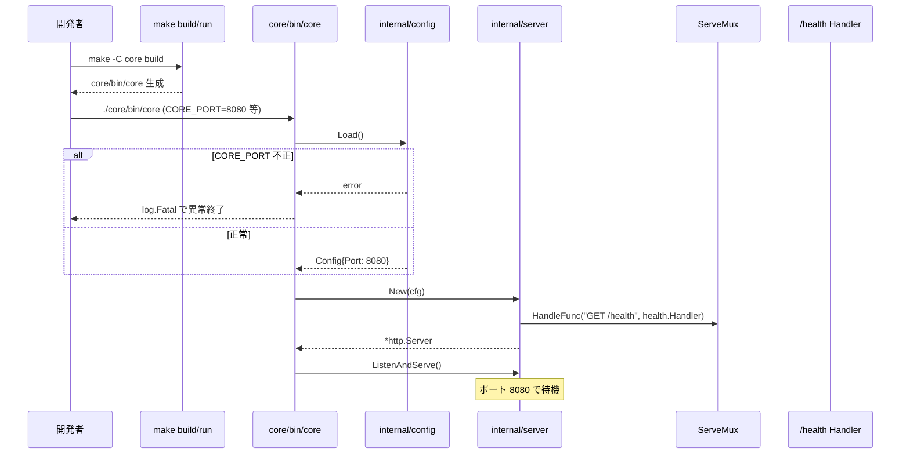
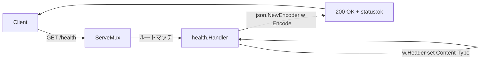

# 設計 #1: core/ の最小 HTTP サーバー

- 関連要求: [`docs/requirements/1/index.md`](../../requirements/1/index.md)
- 関連 Issue: [#1](https://github.com/mktkhr/id-core/issues/1)
- マイルストーン: [M0.1: core/ の最小 HTTP サーバー](https://github.com/mktkhr/id-core/milestone/1)
- 状態: 着手中
- 起票日: 2026-05-02
- 最終更新: 2026-05-02

## 関連資料

- 要求文書: [`docs/requirements/1/index.md`](../../requirements/1/index.md)
- 認可マトリクス (正本): [`docs/context/authorization/matrix.md`](../../context/authorization/matrix.md) (本スコープは認可対象外)
- アーキテクチャ概要: [`docs/context/app/architecture.md`](../../context/app/architecture.md)
- backend 規約: [`docs/context/backend/conventions.md`](../../context/backend/conventions.md), [`docs/context/backend/patterns.md`](../../context/backend/patterns.md), [`docs/context/backend/registry.md`](../../context/backend/registry.md)
- 関連 ADR: なし (本スコープでの新規 ADR 起票も予定なし。論点 Q1 のルーティング判断は context/backend/conventions.md に追記する)

## 要件の解釈

`core/` は **id-core 本体 (OIDC OP)** の Go 実装が乗るディレクトリ。M0.1 ではここに「ビルドできて、起動でき、`/health` が定型 JSON を返す」骨格だけを置く。後続マイルストーン (M0.2 ログ規約 / M0.3 DB 接続 / M1.x OIDC エンドポイント群) はこの骨格を拡張する形で乗せていく。

要求 F-1〜F-7 を以下のように分解する:

| 要求                           | 設計対応                                                                                                        |
| ------------------------------ | --------------------------------------------------------------------------------------------------------------- |
| F-1 (`go.mod` 初期化)          | `core/go.mod` を `module github.com/mktkhr/id-core/core` で初期化                                               |
| F-2 (`build` ターゲット)       | `core/Makefile` に `build` / `run` / `test` / `clean` を定義                                                    |
| F-3 (バイナリ生成)             | `core/cmd/core/main.go` をエントリポイントとし、`core/bin/core` に出力 (論点 Q4)                                |
| F-4 (`/health` エンドポイント) | 標準 `net/http` の `ServeMux` で `/health` をハンドル (論点 Q1)、`{"status":"ok"}` を `application/json` で返却 |
| F-5 (`CORE_PORT` 環境変数)     | デフォルト `8080` (論点 Q3)、未設定はデフォルト適用、不正値は `log.Fatal` で起動失敗                            |
| F-6 (README)                   | `core/README.md` に Go バージョン (`1.24+`)、ビルド・起動・確認手順、期待出力例                                 |
| F-7 (自動検証)                 | `core/internal/health/health_test.go` に `httptest` ベースのユニットテスト                                      |

## 設計時の論点

| #   | 論点                                                      | 候補                                          | 決定                    | 理由                                                                                                                                              |
| --- | --------------------------------------------------------- | --------------------------------------------- | ----------------------- | ------------------------------------------------------------------------------------------------------------------------------------------------- |
| Q1  | ルーティングは標準 `net/http` の `ServeMux` か `chi` 等か | (a) 標準のみ (b) chi 採用                     | **(a) 標準のみ**        | M0.1 はエンドポイント 1 個。標準 `ServeMux` (Go 1.22+ のメソッド・パスパターン対応) で十分。OIDC エンドポイント追加 (M1.x) で再評価する           |
| Q2  | `/health` の追加フィールド                                | (a) `status` のみ (b) `status` + `version` 等 | **(a) `status` のみ**   | M0.1 は最小骨格。`version` 等は `git describe` 経由で出すロジックが必要なため M0.2 以降で検討                                                     |
| Q3  | デフォルトリッスンポート                                  | (a) 8080 (b) 8081 (c) その他                  | **(a) `8080`**          | Web/HTTP のデフォルト慣習。`docker/compose.yaml` で他コンテナと衝突しないよう確認済み (現状他に 8080 を使うサービスなし)                          |
| Q4  | バイナリ出力先パス                                        | (a) `core/bin/core` (b) `core/cmd/core/core`  | **(a) `core/bin/core`** | エントリポイントは `core/cmd/core/` 配下 (Go 慣習)、ビルド成果物は `core/bin/` (Makefile target で `go build -o core/bin/core ./cmd/core` を実行) |

## 実装対象

| モジュール                         |    実装有無     |
| ---------------------------------- | :-------------: |
| `core/`                            |       ✅        |
| `examples/go-react/backend/`       |        —        |
| `examples/go-react/frontend/`      |        —        |
| `examples/kotlin-nextjs/backend/`  |        —        |
| `examples/kotlin-nextjs/frontend/` |        —        |
| データベース                       | — (M0.3 で対応) |

## ディレクトリ構成

```
core/
├── go.mod
├── Makefile
├── README.md
├── .gitignore                 # core/bin/ を除外
├── cmd/
│   └── core/
│       └── main.go            # エントリポイント (config 読み込み + サーバー起動 + log.Fatalf)
├── internal/
│   ├── config/
│   │   ├── config.go          # CORE_PORT 等の環境変数読み込み + バリデーション (error 返却)
│   │   └── config_test.go     # T-5〜T-10 をカバー
│   ├── server/
│   │   └── server.go          # ServeMux 構築 + ハンドラ登録
│   └── health/
│       ├── health.go          # /health ハンドラ
│       └── health_test.go     # T-1〜T-4 をカバー
└── bin/                       # ビルド成果物 (.gitignore で除外)
    └── core
```

> エラー処理の責務分担: `internal/config` は `error` を返す、`cmd/core/main.go` で受けた `error` を `log.Fatalf("CORE_PORT が不正です: %v", err)` で異常終了させる。

> 後続マイルストーン (M0.2 ログ / M0.3 DB) で `internal/logger/`, `internal/infrastructure/` 等が増える前提のディレクトリ規約。

## DB 設計

**スコープ外** (M0.3 で対応)。

## API 設計

### エンドポイント一覧

| Method | Path      | 認証        | 説明             |
| ------ | --------- | ----------- | ---------------- |
| GET    | `/health` | 不要 (公開) | サーバー稼働確認 |

### `GET /health`

**リクエスト**: パラメータなし

**レスポンス (成功)**:

- HTTP `200 OK`
- `Content-Type: application/json; charset=utf-8`
- ボディ:

```json
{ "status": "ok" }
```

**レスポンス (異常)**:

サーバーが起動できていない場合は HTTP レイヤに到達しないため、本エンドポイントとして異常時のレスポンス仕様は定義しない (= 接続失敗 / タイムアウトでクライアントが判定する)。

### CORE_PORT 不正値時の挙動

起動時に `internal/config/config.go` で以下を実施:

1. `CORE_PORT` 環境変数を取得
2. 未設定なら `8080` を採用
3. 設定されている場合は `strconv.Atoi` で数値変換
4. 変換失敗 / `1` 未満 / `65535` 超 のいずれかなら **`error` を返す** (テスト容易性のため `log.Fatal` を直接呼ばない)

`cmd/core/main.go` 側で受けた `error` を `log.Fatalf("CORE_PORT が不正です: %v", err)` で異常終了させる。

> 注: `log.Fatalf` は M0.1 限定の暫定実装。M0.2 で構造化ログに置換する。

## 認可設計

**本スコープは認可対象外**。

`docs/context/authorization/matrix.md` (正本) と差分なし。`/health` は認証不要・公開エンドポイント。

> マスターと差分なし。本スコープでの認可マトリクス変更提案もなし。

## フロー図

### 起動シーケンス



### `/health` リクエスト処理



## テスト観点

### バックエンド (`core/internal/health/health_test.go`)

| #   | カテゴリ | 観点                               | 期待                                                                                                                                              |
| --- | -------- | ---------------------------------- | ------------------------------------------------------------------------------------------------------------------------------------------------- |
| T-1 | 正常系   | `GET /health` を `httptest` で叩く | `200 OK`                                                                                                                                          |
| T-2 | 正常系   | レスポンスヘッダ                   | `Content-Type: application/json` から始まる                                                                                                       |
| T-3 | 正常系   | レスポンスボディ                   | JSON として decode 可、`status` フィールドが `"ok"`                                                                                               |
| T-4 | 準正常系 | 未対応メソッド (`POST /health`)    | `405 Method Not Allowed` + `Allow: GET` (または `GET, HEAD`) ヘッダが返る (Go 1.22 `ServeMux` の標準挙動。将来ルータ差し替え時の後方互換チェック) |

### Config (`core/internal/config/config_test.go`)

| #    | カテゴリ | 観点                              | 期待                                                  |
| ---- | -------- | --------------------------------- | ----------------------------------------------------- |
| T-5  | 正常系   | `CORE_PORT` 未設定                | デフォルト `8080` が返る、エラーなし                  |
| T-6  | 正常系   | `CORE_PORT=9000`                  | `Port=9000` が返る、エラーなし                        |
| T-7  | 異常系   | `CORE_PORT=abc`                   | エラーが返る (メッセージに `CORE_PORT が不正` を含む) |
| T-8  | 境界値   | `CORE_PORT=0`                     | エラー (1 未満)                                       |
| T-9  | 境界値   | `CORE_PORT=65536`                 | エラー (65535 超)                                     |
| T-10 | 境界値   | `CORE_PORT=1` / `CORE_PORT=65535` | 正常                                                  |

> 注: `cmd/core/main.go` の `log.Fatal` 経路は単体テスト困難。`internal/config` 層でエラー返却 → main で `log.Fatal` する分離設計にして、テストはエラー返却の検証で代替する。

### E2E (M0.1 では実施しない)

E2E は M1.5 の go-react RP 接続から導入予定。M0.1 では Go 単体テストのみで完結。

## 既存資料からの差分

`docs/context/` への影響:

- `docs/context/backend/conventions.md`: M0.1 着手時に**新規作成**または既存ファイルへの追記が必要 (現状の規約レベルに「Go モジュール初期化方針 / Makefile 規約 / 環境変数読み込みパターン」を追加)
- `docs/context/backend/registry.md`: `core/internal/{config,server,health}` の各パッケージを registry に登録
- `docs/context/backend/patterns.md`: `httptest` ベースのテスト雛形を 1 つ載せる

> 規約ファイルが空または最小骨格の場合、M0.1 の実装中に最小限のパターンを追加する。

その他の追加対象:

- `core/.gitignore` を新規作成し `bin/` を除外する (実装プロンプトの完了条件に含める)
- ルートの `.gitignore` に `core/bin/` を追記する選択肢もあるが、サブモジュール感を保つため `core/.gitignore` で完結させる方針

## 設計フェーズ状況

| フェーズ               | 状態       | 備考                                                                    |
| ---------------------- | ---------- | ----------------------------------------------------------------------- |
| 1. 起票                | 完了       | 2026-05-02                                                              |
| 2. 下書き              | 完了       | 雛形 → 本文を埋めた                                                     |
| 3. 規約確認            | 完了       | 既存規約は最小骨格のみ。差分整理セクションで context への追記対象を列挙 |
| 4. 論点解決            | 完了       | Q1〜Q4 すべて決定済み                                                   |
| 5. DB 設計             | スコープ外 | M0.3 で対応                                                             |
| 6. API 設計            | 完了       | `/health` のみ                                                          |
| 7. 認可設計            | スコープ外 | 公開エンドポイントのみで認可対象外                                      |
| 8. 図                  | 完了       | 起動シーケンス + `/health` フロー                                       |
| 9. テスト設計          | 完了       | T-1〜T-10                                                               |
| 10. 差分整理           | 完了       | context 更新対象を列挙                                                  |
| 11. 実装プロンプト生成 | 未         | `/spec-prompts` または直接 `/issue-from-spec` で実装 Issue 起票         |

## 変更履歴

| 日付       | 変更内容                                                                                                                                                                                                                                      |
| ---------- | --------------------------------------------------------------------------------------------------------------------------------------------------------------------------------------------------------------------------------------------- |
| 2026-05-02 | 起票 (要求 #1 から `/spec-create` で生成 → 内容を反映)                                                                                                                                                                                        |
| 2026-05-02 | Codex レビュー指摘反映: `--output`→`-o` 修正 (Q4 理由)、ディレクトリ構成に `config_test.go` と `.gitignore` 追加、`log.Fatal`→`log.Fatalf` 表記統一と責務分担明示、T-4 に `Allow` ヘッダ検証追加、context 差分整理に `core/.gitignore` を追記 |
