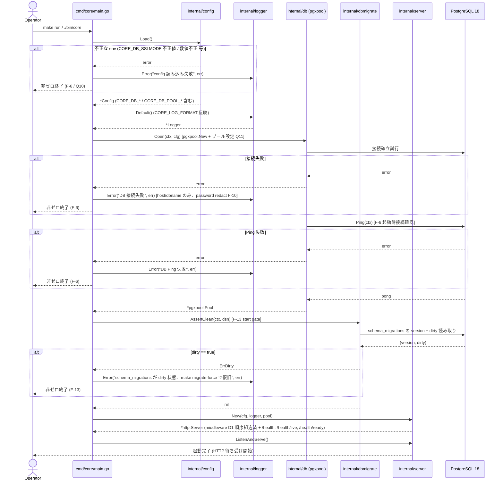
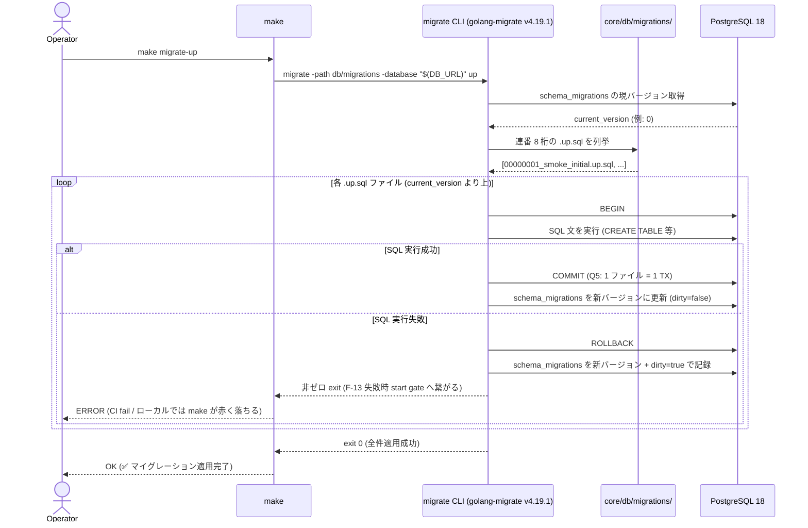
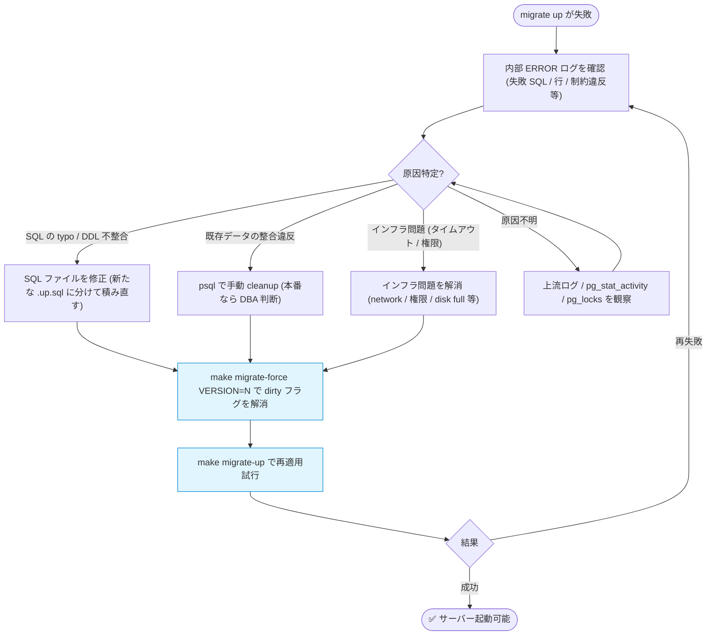
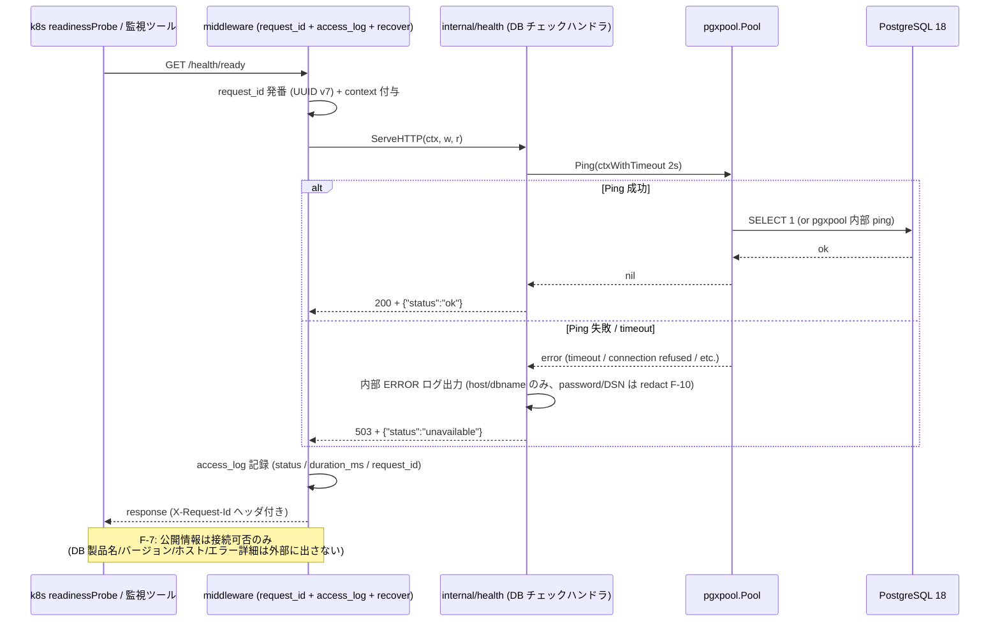
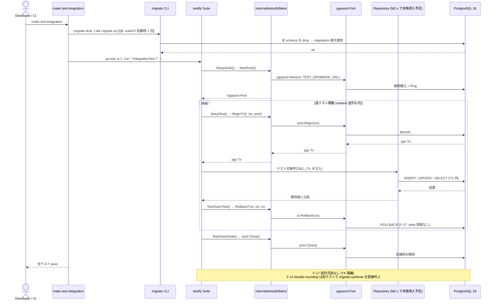
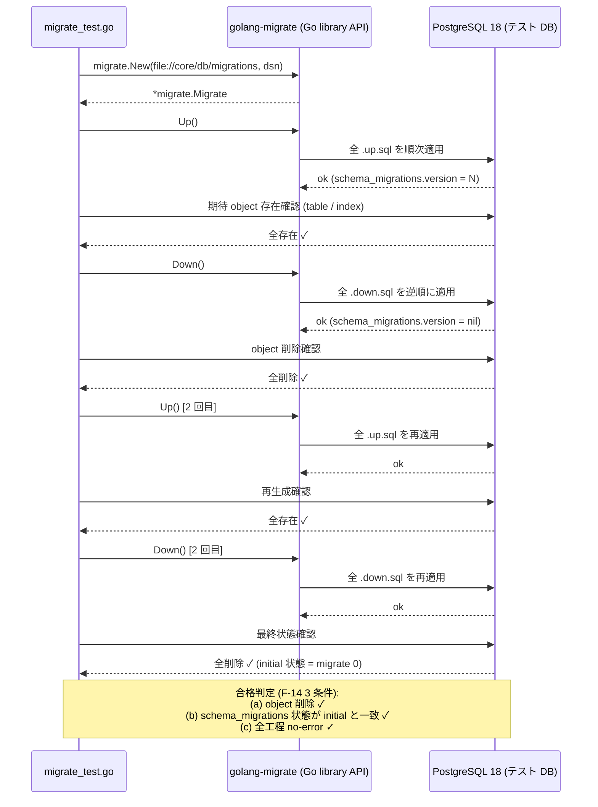

# 設計 #21: DB 接続 + マイグレーション基盤を core/ に導入

- 関連要求: [`docs/requirements/21/index.md`](../../requirements/21/index.md)
- 関連 Issue: [#21](https://github.com/mktkhr/id-core/issues/21)
- マイルストーン: [M0.3: DB 接続 + マイグレーション基盤](https://github.com/mktkhr/id-core/milestone/3)
- 状態: 完了 (実装フェーズへ移行)
- 起票日: 2026-05-02
- 最終更新: 2026-05-02

## 関連資料

- 要求文書: [`docs/requirements/21/index.md`](../../requirements/21/index.md)
- 認可マトリクス (正本): [`docs/context/authorization/matrix.md`](../../context/authorization/matrix.md) (本スコープは認可対象外)
- 先行設計書:
  - [`docs/specs/1/index.md`](../1/index.md) (M0.1: core/ の最小 HTTP サーバー)
  - [`docs/specs/7/index.md`](../7/index.md) (M0.2: ログ・エラー・request_id 規約 + middleware)
- アーキテクチャ概要: [`docs/context/app/architecture.md`](../../context/app/architecture.md)
- backend 規約: [`docs/context/backend/conventions.md`](../../context/backend/conventions.md), [`docs/context/backend/patterns.md`](../../context/backend/patterns.md), [`docs/context/backend/registry.md`](../../context/backend/registry.md)
- 関連スキル: `/backend-sqlc` (Repository 実装ガイド), `/backend-architecture` (Domain 層分離), `/backend-security` (シークレット redact / TLS), `/backend-logging` (DB ログの context 伝播)
- 関連 ADR: なし (本スコープでの新規 ADR は論点解決時に判断。Q12 で規約書配置を `docs/context/backend/conventions.md` 以外に決定する場合は要起票)

## 要件の解釈

`core/` (id-core 本体) に **PostgreSQL 接続層 + マイグレーション基盤**を導入する設計。M0.2 までに整備されたログ・エラー・request_id 基盤の上に、後続マイルストーン (M2.1 クライアント DB / M2.2 認可コード DB / M3.1 ユーザー DB / M7.1 監査ログ) が乗れる**接続スタック + マイグレーション運用規約**を確立する。

新規エンドポイントとしては `/health` 系の DB チェック拡張のみ追加する (Q6 で形式確定)。実テーブル DDL はスコープ外で、最低限のスモークテーブル 1 つで up/down round-trip 検証のみ行う。

要求 F-1〜F-18 を以下のように分解する:

| 要求                                                     | 設計対応                                                                                                                                                                                                                                                                                                                                                                                                                                                                                                                                                    |
| -------------------------------------------------------- | ----------------------------------------------------------------------------------------------------------------------------------------------------------------------------------------------------------------------------------------------------------------------------------------------------------------------------------------------------------------------------------------------------------------------------------------------------------------------------------------------------------------------------------------------------------- |
| F-1 (DB 接続 + パスワード独立 env)                       | `internal/db/` に config 受け取り → DSN 組み立て → `*pgxpool.Pool` 生成のロジックを置く (Q3 決定)。env は Q7 決定の個別 6 個 (`CORE_DB_HOST` / `CORE_DB_PORT` / `CORE_DB_USER` / `CORE_DB_PASSWORD` / `CORE_DB_NAME` / `CORE_DB_SSLMODE`)。**パスワードは独立 env で受け取る** (F-1 最低ライン)                                                                                                                                                                                                                                                             |
| F-2 (マイグレーションツール + 配置)                      | Q2 決定により `golang-migrate/migrate` v4 を採用。マイグレーションファイルは `core/db/migrations/` 配下に配置                                                                                                                                                                                                                                                                                                                                                                                                                                               |
| F-3 (Make ターゲット)                                    | Q2 決定の Makefile 9 ターゲット (`migrate-install` / `migrate-create` / `migrate-up` / `migrate-up-one` / `migrate-down` / `migrate-down-all` / `migrate-force` / `migrate-version` / `migrate-status`) を `core/Makefile` に追加                                                                                                                                                                                                                                                                                                                           |
| F-4 (ファイル命名規則)                                   | Q4 決定の `{8桁連番}_{snake_case slug}.{up\|down}.sql` を採用 → 規約書 (Q12 = `docs/context/backend/conventions.md`) に記載                                                                                                                                                                                                                                                                                                                                                                                                                                 |
| F-5 (TX 境界)                                            | Q5 決定の「1 ファイル = 1 TX (デフォルト) + 例外節」を規約書に記載。CONCURRENTLY 系は別ファイル分離 + 当面回避                                                                                                                                                                                                                                                                                                                                                                                                                                              |
| F-6 (起動時 DB 接続確認 + 非ゼロ終了)                    | `cmd/core/main.go` の起動シーケンスで `pool.Ping(ctx)` による接続確認を実行。失敗時は `logger.Error(ctx, "DB 接続失敗", err)` + 非ゼロ終了 (`log.Fatal*` 不使用)。詳細終了処理は Q9 決定の起動シーケンスに準拠                                                                                                                                                                                                                                                                                                                                              |
| F-7 (`/health` 系 DB チェック + 公開粒度)                | Q6 決定により `/health/live` + `/health/ready` 分割を採用。公開する情報は **「DB 接続可否」のみ** (DB 製品名・バージョン・ホスト・接続文字列・内部エラー詳細は出さない)。詳細は内部 ERROR ログのみに記録                                                                                                                                                                                                                                                                                                                                                    |
| F-8 (DB クライアントライブラリ)                          | Q3 決定により `pgx/v5` 直接 (`pgxpool.Pool`) を採用。sqlc は M2.x で本格導入予定 (`sql_package: "pgx/v5"`)                                                                                                                                                                                                                                                                                                                                                                                                                                                  |
| F-9 (コネクションプール)                                 | `internal/db/` の Open API でプール設定を受け付ける。既定値は Q11 決定 (`MaxConns=10` / `MinConns=1` / `MaxConnLifetime=5m` / `MaxConnIdleTime=2m` / `HealthCheckPeriod=30s`)、env (`CORE_DB_POOL_*` 5 個) で上書き可                                                                                                                                                                                                                                                                                                                                       |
| F-10 (シークレット redact)                               | M0.2 の deny-list (`docs/context/backend/conventions.md` の redact 一覧) に DSN / 接続文字列の取り扱い節を追記。`Open` の失敗ログでは host / dbname のみ出し、password / DSN フルダンプを禁止                                                                                                                                                                                                                                                                                                                                                               |
| F-11 (docker compose)                                    | `docker/compose.yaml` に PostgreSQL service を追加 (Q1 決定により初期採用 image tag = `postgres:18.3`、patch まで pin)。テスト/開発から接続できる設定を整える。テスト DB 初期化方針は Q8 決定 (drop & migrate up を suite/CI 起動時 1 回)                                                                                                                                                                                                                                                                                                                   |
| F-12 (CI で migrate up → test)                           | CI ワークフロー (`.github/workflows/`) に DB service container + migrate up step を追加。Q8/Q9 決定により `make migrate-up` → `make test-integration` の順で明示実行                                                                                                                                                                                                                                                                                                                                                                                        |
| F-13 (失敗時 start gate + 運用導線)                      | migrate up 失敗時は次回起動を block (Q9 決定の `dbmigrate.AssertClean` で実装)。`schema_migrations` の dirty フラグ解消手順 (`make migrate-force VERSION=<n>`) / 旧バージョン image rollback / 手動 down 手順 を規約書に記載                                                                                                                                                                                                                                                                                                                                |
| F-14 (double-roundtrip 整合)                             | `core/internal/dbmigrate/migrate_test.go` で up→down→up→down を実行し、(a) object 削除 / (b) `schema_migrations` 状態 / (c) 全工程 no-error を assert                                                                                                                                                                                                                                                                                                                                                                                                       |
| F-15 (`make build/test/lint` pass)                       | 既存 Makefile 拡張 (M0.2 で確立した lint = `go vet` + `log.Fatal*` 検査をそのまま継続)                                                                                                                                                                                                                                                                                                                                                                                                                                                                      |
| F-16 (規約書の最低必須項目)                              | Q12 決定により `docs/context/backend/conventions.md` の DB / マイグレーション節を本スコープで詳細化。最低必須項目: (1) DB 製品・ライブラリ・ツール選定 / (2) 環境変数一覧 (`CORE_DB_*`) / (3) 命名規則と例 / (4) TX 境界 / (5) 開発者向け運用手順 (compose / make / CI / migrate 失敗復旧)                                                                                                                                                                                                                                                                  |
| F-17 (テスト並列隔離下限)                                | Q8 決定の **ハイブリッド (tx-rollback + drop & migrate up を suite/CI 起動時 1 回)** で並列汚染を回避。最低ライン: 並列実行で state 汚染なし / 失敗後の残留 state が次のテスト実行を block しない                                                                                                                                                                                                                                                                                                                                                           |
| F-18 (DB 経路の context.Context 受け取り + 相関 ID 伝播) | 本マイルストーンスコープでは `internal/db/` の Open / Ping API、`internal/dbmigrate/` の AssertClean / migrate 実行 API、`internal/testutil/dbtest/` の BeginTx / RollbackTx ヘルパーすべてを `ctx context.Context` 引数で受け取る構造とする。M0.2 の F-14 (Domain 層からロガー直呼び禁止 / context から取り出すのみ) と D1 順序の context 伝播規約を踏襲。DB 接続失敗・migrate 失敗のログには `request_id` / `event_id` を自動付与。**クエリ層 (Repository / sqlc 連携) は本スコープ外で M2.x 以降に導入**、その時点で同 API の context 引数規約を踏襲する |

## 設計時の論点

要求文書から引き継いだ論点 Q1〜Q12 (全件解決済) と、設計フェーズで判明した内部論点 D1〜。決定責任者は全件 mktkhr、期限は 2026-05-16 (要求文書と整合)。

### 設計フェーズで判明した内部論点

| #   | 論点                                                     | 候補                                                                                            | 決定         | 理由                                                                                                                                                                                                                                                                                                                                                                                                                                                                                                                                                                                                                            |
| --- | -------------------------------------------------------- | ----------------------------------------------------------------------------------------------- | ------------ | ------------------------------------------------------------------------------------------------------------------------------------------------------------------------------------------------------------------------------------------------------------------------------------------------------------------------------------------------------------------------------------------------------------------------------------------------------------------------------------------------------------------------------------------------------------------------------------------------------------------------------- |
| D1  | `internal/db/` と `internal/dbmigrate/` のパッケージ境界 | (a) 分離 (本設計書の構成案) (b) 1 パッケージ統合 (`internal/db/` 配下に migrate サブモジュール) | **(a) 分離** | (1) `internal/db/` は pgxpool 生成 + 接続管理 + DSN 組み立てに責務を限定し、アプリケーションランタイムの常時利用パスに置く。(2) `internal/dbmigrate/` は migrate ライブラリ (`golang-migrate/migrate/v4`) への依存を持ち、起動時 dirty チェック (`AssertClean`) と将来の library API 経由 migrate 実行のみに使う、低頻度の経路。(3) **依存方向を分離する**ことで、`internal/db/` を import するモジュールが migrate ライブラリ依存を引き込まずに済む。(4) 統合案 (b) はファイル数が減るがビルド時の依存ツリーが膨らみテスト境界が曖昧化する。(5) パッケージ境界の名前 (`db` / `dbmigrate`) は Go コミュニティの一般的慣例と整合 |

### 要求文書から引き継いだ論点 (Q1〜Q12)

| #   | 論点                                            | 候補                                                                                                                                                                           | 決定                                                                                                                                                                                                                                                                                                                                                                  | 理由                                                                                                                                                                                                                                                                                                                                                                                                                                                                                                                                                                                                                                                                                                                                                                                                                                                                                                                                                                      |
| --- | ----------------------------------------------- | ------------------------------------------------------------------------------------------------------------------------------------------------------------------------------ | --------------------------------------------------------------------------------------------------------------------------------------------------------------------------------------------------------------------------------------------------------------------------------------------------------------------------------------------------------------------- | ------------------------------------------------------------------------------------------------------------------------------------------------------------------------------------------------------------------------------------------------------------------------------------------------------------------------------------------------------------------------------------------------------------------------------------------------------------------------------------------------------------------------------------------------------------------------------------------------------------------------------------------------------------------------------------------------------------------------------------------------------------------------------------------------------------------------------------------------------------------------------------------------------------------------------------------------------------------------- |
| Q1  | DB 製品とバージョン                             | (a) PostgreSQL 18.x (b) PostgreSQL 17.x (c) PostgreSQL 16.x (d) その他                                                                                                         | **(a) PostgreSQL 18.x、初期採用は `postgres:18.3`** (`docker compose` の image tag は `postgres:18.3` で patch まで pin。AWS RDS でも 2026-02 時点で 18.3 が GA 提供済)。**バージョン更新ポリシー**: PostgreSQL の四半期 patch リリースに合わせた tag 更新判断は規約書の「運用ガイド」節に集約 (採用 patch 自体は本決定で 18.3 確定、以後は patch 更新ポリシーに従う) | (1) 2025-09-25 GA / コミュニティサポート 2030-11 頃まで。(2) AWS RDS PostgreSQL 18 が 2025-11 から GA、2026-02 時点で minor 18.2/18.3 まで提供済で本番化先 (RDS) の前提と整合。(3) `uuidv7()` ネイティブ関数を搭載しており、本プロジェクトの UUID v7 ポリシー (M0.2 で確立、v4 禁止) と将来の DB 主キーで親和性が高い。(4) 非同期 I/O (最大 3× 性能向上) / Skip scan B-tree / OAuth 認証 / Temporal constraints も将来活用余地。(5) M0.2 確立の「ランタイム / 依存は Active LTS 相当の最新を独自確認して使う」方針と整合。**`<minor>`/`<patch>` プレースホルダ表現を排除**し、採用時点の具体 patch (`18.3`) を本決定に明記することで pin 約束の運用実体を担保                                                                                                                                                                                                                                                                                                             |
| Q2  | マイグレーションツール                          | (a) `golang-migrate/migrate` v4 (b) `pressly/goose` (c) `ariga/atlas` (d) その他                                                                                               | **(a) `golang-migrate/migrate` v4** + **CLI binary 運用 (Makefile ターゲット 9 種)**                                                                                                                                                                                                                                                                                  | (1) SQL-first / `.up.sql` / `.down.sql` 分離が要件 F-2 / F-4 / F-5 と素直に一致。(2) `schema_migrations` テーブルの version + **dirty フラグ**を持つため F-13 (start gate) を Go ライブラリ API (`migrate.New().Version()`) で直接実装可能。(3) PoC / 検証用としては最も枯れた標準で学習コストが最低。(4) sqlc 連携 (将来) も schema ディレクトリ指定だけで成立。(5) PostgreSQL 18 対応済 (driver = `postgres` build tag)。**CLI 運用方針**: `migrate-install` / `migrate-create NAME=<slug>` / `migrate-up` / `migrate-up-one` / `migrate-down` / `migrate-down-all` / `migrate-force VERSION=<n>` / `migrate-version` / `migrate-status` の 9 ターゲットを `core/Makefile` に追加。本マイルストーンでは local + CI のみで完結させ、本番 / staging 向け migrate ターゲットは別マイルストーンで導入。**バージョン pin**: `MIGRATE_VERSION := v4.19.1` 相当を Makefile 先頭で変数化、`go install -tags 'postgres' ...@$(MIGRATE_VERSION)` で固定インストール               |
| Q3  | DB クライアントライブラリ                       | (a) `database/sql` + `pgx/v5` driver (b) `pgx/v5` 直接 (`pgxpool.Pool`) (c) `database/sql` + `lib/pq` (d) `sqlx`                                                               | **(b) `pgx/v5` 直接 (`pgxpool.Pool`)**                                                                                                                                                                                                                                                                                                                                | (1) sqlc が `sql_package: "pgx/v5"` でネイティブ pgx 向け `DBTX` interface (`pgconn.CommandTag` / `pgx.Rows` / `pgx.Row`) を生成 → 後続 M2.x 以降の sqlc 本格導入が schema ディレクトリ指定 1 行の追加で済む。(2) `pgxpool` で binary copy / named prepared statements / listen/notify など pgx 特有の機能をフル活用可能 (OIDC OP の `keys` rotation / セッション通知 等で将来活きる)。(3) 行なし判定は `errors.Is(err, pgx.ErrNoRows)`、TX は `Queries.WithTx(tx pgx.Tx)` で扱う。(4) golang-migrate (Q2) は内部で `database/sql + database/postgres` driver を使うが、アプリ層の pgxpool と別経路で共存し、同一 DSN フォーマット / 同一 PostgreSQL 18 で問題なし。**起動コード方針**: `cmd/core/main.go` で `pgxpool.New(ctx, dsn)` → `defer dbPool.Close()` → `dbPool.Ping(ctx)` (F-6)。**バージョン pin**: `github.com/jackc/pgx/v5` の採用時点最新安定版                                                                                                             |
| Q4  | マイグレーションファイル命名規則                | (a) `{8桁連番}_{slug}.{up\|down}.sql` (b) `{タイムスタンプ}_{slug}.{up\|down}.sql` (c) ツール既定                                                                              | **(a) `{8桁連番}_{snake_case slug}.{up\|down}.sql`** (`migrate create -ext sql -dir core/db/migrations -seq -digits 8 <NAME>`)                                                                                                                                                                                                                                        | (1) golang-migrate の `-seq -digits 8` で生成可能。(2) 8 桁にすることで M2.x 〜 M7.x の全マイルストーンで増えるであろう migration 件数 (数百規模) を余裕を持って収容 (6 桁の最大は 999,999、8 桁は 99,999,999)。(3) 連番方式は branch merge 時の衝突検出が必要だが、CI lint で `ls core/db/migrations/ \| awk -F_ '{print $1}' \| sort \| uniq -d` で重複連番を検出可能。(4) タイムスタンプ方式は衝突しないが順序の視認性が下がるため不採用。**例**: `00000001_smoke_initial.up.sql` / `00000001_smoke_initial.down.sql`。**slug 規約**: `snake_case`、英語、動詞 + 対象 (`create_users` / `add_email_to_users` 等)、最大 50 文字目安                                                                                                                                                                                                                                                                                                                                     |
| Q5  | マイグレーション・トランザクション境界          | (a) 1 ファイル = 1 TX (デフォルト) + 例外節 (b) ファイル内 BEGIN/COMMIT 明示 (c) ツール既定                                                                                    | **(a) 1 ファイル = 1 TX (デフォルト) + 例外節 (CONCURRENTLY 系はファイル分離 + 当面避ける)**                                                                                                                                                                                                                                                                          | (1) golang-migrate (Q2) の PostgreSQL driver は各 migration ファイルを自動的に TX ラップする固定挙動。(b) は二重 TX エラーで実質不可、(c) は (a) と同義。(2) **TX 内不可 DDL (`CREATE INDEX CONCURRENTLY` / `DROP INDEX CONCURRENTLY` / `REINDEX CONCURRENTLY` 等) は別ファイル分離 + slug で明示** (`00000011_add_users_email_index_concurrently.up.sql` 等)。当面はこれらを避け、必要時は個別 `make migrate-up-one` + 手動運用 + `migrate-force` 復旧経路を規約書に記載。(3) golang-migrate Issue [#284](https://github.com/golang-migrate/migrate/issues/284) の `x-no-transaction` URL パラメータは公式採用されていないため依存しない                                                                                                                                                                                                                                                                                                                                 |
| Q6  | `/health` の DB チェック方針 (status code 含む) | (a) `/health` JSON に `db` フィールド追加 (異常時 status code 別途) (b) `/health/live` + `/health/ready` 分割 (異常時 ready=503) (c) `/health/db` 新設 (異常時 503)            | **(b) `/health/live` + `/health/ready` 分割** (既存 `/health` は 200 + `{"status":"ok"}` のまま外形互換維持)                                                                                                                                                                                                                                                          | (1) k8s probe ベストプラクティス完全準拠 (livenessProbe = `/health/live`、readinessProbe = `/health/ready`)。(2) 既存 `/health` の挙動を破壊せず、後方互換性を維持しつつ機能追加できる。(3) Keycloak / Hydra 等の OIDC OP 慣例とも整合。(4) 将来 (M4.x 上流 IdP 連携 / M2.x cache / M5.x 外部 SMS 等) で依存先が増えたら `/health/ready` 内で集約チェックすれば endpoint を増やさず吸収可。(5) F-7 (情報露出下限) と整合: 200 = `{"status":"ok"}`、503 = `{"status":"unavailable"}` のみで、どの依存先が失敗したかは外部に露出しない (詳細は内部 ERROR ログのみ)。**仕様**: (a) `/health` GET → 200 `{"status":"ok"}` (既存維持) / (b) `/health/live` GET → 200 `{"status":"ok"}` (DB チェックなし、プロセス疎通のみ) / (c) `/health/ready` GET → 正常時 200 `{"status":"ok"}`、依存先異常時 503 `{"status":"unavailable"}`。DB チェックは `pgxpool.Pool.Ping(ctx)` (timeout 1〜3 秒、本マイルストーンでは毎回叩く運用、cache 戦略は将来再検討)                           |
| Q7  | 接続文字列の組み立て方                          | (a) 個別 env を組み立てて DSN 化 (b) DSN env (`CORE_DATABASE_URL`) + パスワード独立 env のハイブリッド (c) DSN env にパスワード含める方式 — F-1 最低ラインを満たさず**不採用** | **(a) 個別 env 方式** (env 名: `CORE_DB_HOST` / `CORE_DB_PORT` / `CORE_DB_USER` / `CORE_DB_PASSWORD` / `CORE_DB_NAME` / `CORE_DB_SSLMODE` の 6 個)                                                                                                                                                                                                                    | (1) F-1 最低ライン (パスワード独立 env) を素直に満たす — `CORE_DB_PASSWORD` が他の接続要素と分離。(2) アプリ層 (`internal/db/dsn.go`) で `fmt.Sprintf("postgres://%s:%s@%s:%s/%s?sslmode=%s", url.QueryEscape(user), url.QueryEscape(password), host, port, dbname, sslmode)` で組み立て (記号や日本語が混じる可能性のある user/password は `url.QueryEscape` でエスケープ)。(3) Makefile (`migrate-*` ターゲット) も個別 env を参照: `DB_URL := postgres://$(CORE_DB_USER):$(CORE_DB_PASSWORD)@$(CORE_DB_HOST):$(CORE_DB_PORT)/$(CORE_DB_NAME)?sslmode=$(CORE_DB_SSLMODE)`。(4) F-10 (redact) と整合: ログ出力時は `password` を deny-list で `[REDACTED]` 化し、`host` / `dbname` 等のシークレットを含まない要素のみ出力。(5) F-NFR セキュリティ最低ライン (本番平文不可、Q10) は `CORE_DB_SSLMODE` で制御。(6) PaaS の `DATABASE_URL` 単一 env 形式は本マイルストーンスコープ外、将来必要なら parse 互換層を追加                                                       |
| Q8  | テスト用 DB の初期化方針                        | (a) 毎テスト前に drop & recreate (b) compose 起動時に 1 度初期化、テストは migrate 済み DB を共有 (c) tx-rollback 方式                                                         | **ハイブリッド: (c) tx-rollback (テスト単位) + (a) drop & migrate up (suite/CI 起動時 1 回)**                                                                                                                                                                                                                                                                         | (1) 各テストは `pool.Begin(ctx)` → `tx.Rollback()` で TX 内に隔離、`t.Parallel()` も TX 単位で安全。(2) drop & migrate up は CI 起動時 1 回だけ走らせ、毎テストの drop オーバーヘッド (秒〜分単位) を回避。(3) F-17 並列汚染は TX 隔離で解決、残留 state は rollback で確実に解消。(4) `go test -p 1` (package 単位順次) は **integration テスト用 DB を全 package で共有するため**の package 間衝突回避策。同一 package 内では `t.Parallel()` でも TX が独立するため並列可。(5) Repository は `pgx.Tx` / `*pgxpool.Pool` 両対応 (sqlc の `DBTX` interface 経由)。(6) ヘルパー `internal/testutil/dbtest/` (仮) に `NewPool` / `BeginTx` / `RollbackTx` を提供し、testify suite の `SetupSuite` / `SetupTest` / `TearDownTest` パターンで利用。**Makefile**: `make test-integration` ターゲットを別途追加 (`migrate drop -f && migrate up && go test -p 1 -run ".*IntegrationTest.*" ./...`)。`make test` は DB 不要テスト (M0.2 までの既存テスト) のみ並列実行 (`-race`) |
| Q9  | マイグレーション実行タイミング                  | (a) サーバ起動時に自動 migrate up (b) サーバ起動と独立した make ターゲット / コマンド (c) ハイブリッド                                                                         | **(b) サーバ起動と独立した make ターゲット + 起動時 dirty チェックのみ (F-13 start gate)**                                                                                                                                                                                                                                                                            | (1) 本番運用で auto migrate は DDL リスクが高く運用判断と分離するのが安全。(2) F-13 start gate は migrate 適用と独立した「起動時の dirty フラグ検査」として実装することで責務を明確化。(3) Go コミュニティの一般的な Makefile 慣例も `run` ターゲットに migrate を含めず `make migrate-up` を明示実行する形が多い → 慣例と整合。(4) CI も `make migrate-up` → `make test-integration` で順序明示できる。**起動シーケンス**: `cmd/core/main.go` → `config.Load` → `logger.Default` → `pgxpool.New` → `pool.Ping` (F-6) → `dbmigrate.AssertClean(ctx, dsn)` で `migrate.New().Version()` の dirty を検査し dirty なら起動拒否 (F-13) → `server.New` → `ListenAndServe`。**`AssertClean` は migrate を実行せず読み取りのみ**。dirty 解消は `make migrate-force VERSION=<n>` (Q2) で手動運用                                                                                                                                                                                  |
| Q10 | SSL/TLS 接続要件                                | (a) 本番想定 = `require` 以上 / 開発 = `disable` 許可 (b) 全環境で `require` (c) 全環境で `disable` 許可 — F-NFR セキュリティ最低ラインを満たさず**不採用**                    | **(a) 本番想定 = `require` 以上 (`require` / `verify-ca` / `verify-full`) / 開発・テスト・CI = `disable` 許可**                                                                                                                                                                                                                                                       | (1) 本マイルストーンは PoC で docker compose 内ローカル通信のみだが、本番想定では平文接続を許容しない (F-NFR セキュリティ最低ライン)。(2) `CORE_DB_SSLMODE` の許容値: `disable` / `allow` / `prefer` / `require` / `verify-ca` / `verify-full` の 6 種を `internal/config/config.go` の `Load()` で許容値照合バリデーション、それ以外は起動失敗。(3) **本番想定では `disable` / `allow` / `prefer` を不許可**とし、`require` / `verify-ca` / `verify-full` のみ許容する追加バリデーション (本番識別の env 変数 `CORE_ENV` 等の導入詳細は M0.4 以降)。(4) **本番推奨ライン**: `verify-full` (CA + hostname 検証、MITM 耐性最強)。RDS の場合は AWS 提供の RDS root CA 証明書を `sslrootcert` パラメータで指定する運用を規約書に明記。(5) 開発時は compose 内 PostgreSQL コンテナとの localhost 通信のため `disable` をデフォルト値                                                                                                                                          |
| Q11 | コネクションプール既定値                        | (a) MaxOpen=10 / MaxIdle=2 / Lifetime=5min (b) ライブラリ既定 (c) その他                                                                                                       | **(c) `MaxConns=10` / `MinConns=1` / `MaxConnLifetime=5m` / `MaxConnIdleTime=2m` / `HealthCheckPeriod=30s` + 環境変数で上書き可能**                                                                                                                                                                                                                                   | (1) pgxpool 既定 (`MaxConns=max(4, NumCPU)` / `MaxConnLifetime=1h` / `MaxConnIdleTime=30m`) は PoC 用としてはやや太め、Lifetime も長すぎ。(2) `MinConns=1` で cold start (初回リクエストの接続待ち) を回避。(3) Lifetime 5 分は PostgreSQL サーバー側設定 (`idle_in_transaction_session_timeout` 等) との兼ね合いで安全側。(4) `MaxConnIdleTime=2m` で idle リソース解放を早める。(5) **環境変数で上書き可** (F-9): `CORE_DB_POOL_MAX_CONNS` / `CORE_DB_POOL_MIN_CONNS` / `CORE_DB_POOL_MAX_CONN_LIFETIME` / `CORE_DB_POOL_MAX_CONN_IDLE_TIME` / `CORE_DB_POOL_HEALTH_CHECK_PERIOD` の 5 個。Duration は `time.ParseDuration` 互換 (`5m` / `30s` / `1h30m` 等)。負数・不正値は起動失敗。(6) **本番想定**は PoC とは別、規約書の「運用ガイド」節に「負荷見積もりに応じて `MaxConns` を 20〜50 等に拡大」を明記し、M1.x 以降の負荷試験で再調整                                                                                                                              |
| Q12 | 規約書の格納場所                                | (a) `docs/context/backend/conventions.md` の DB / マイグレーション節 (b) `core/docs/db/conventions.md` (c) `docs/specs/21/`                                                    | **(a) `docs/context/backend/conventions.md` の DB / マイグレーション節を詳細化 + 関連 3 ファイル (`patterns.md` / `registry.md` / `testing/backend.md`) も併記**                                                                                                                                                                                                      | (1) M0.2 の Q10 決定 (単一 SoT として `docs/context/backend/conventions.md` 集約、新規ディレクトリ作成回避) と整合。(2) 後続 M2.x / M3.x の DB 規約も同ファイルに集約していくと参照容易。(3) F-16 の最低必須項目 5 件 (DB 製品・ライブラリ・ツール選定 / 環境変数一覧 / 命名規則 / TX 境界 / 運用手順) は `conventions.md` の DB / マイグレーション節に収納。(4) **関連ファイルへの分散記載**: `patterns.md` (実装パターン: pgxpool 起動 + Ping + start gate / migrate 運用 / 統合テスト)、`registry.md` (パッケージマッピング `internal/db` / `internal/dbmigrate` / `internal/testutil/dbtest` + 環境変数 11 個 + マイグレーション一覧)、`testing/backend.md` (DB を要するテストパターン + migrate 整合テスト F-14)。本スコープでは **conventions.md は規約本文 / patterns.md は実装サンプル / registry.md はマッピング / testing は手順** という M0.2 で確立した分担を踏襲                                                                                             |

## 実装対象

| モジュール                         |                                    実装有無                                     |
| ---------------------------------- | :-----------------------------------------------------------------------------: |
| `core/`                            |                                       ✅                                        |
| `examples/go-react/backend/`       |                                        —                                        |
| `examples/go-react/frontend/`      |                                        —                                        |
| `examples/kotlin-nextjs/backend/`  |                                        —                                        |
| `examples/kotlin-nextjs/frontend/` |                                        —                                        |
| データベース                       | ✅ (PostgreSQL 接続 + マイグレーション基盤、実テーブル DDL は M2.x/M3.x で別途) |
| `docker/compose.yaml`              |                          ✅ (PostgreSQL service 追加)                           |
| CI ワークフロー                    |                  ✅ (DB service container + migrate step 追加)                  |

## ディレクトリ構成 (予定)

M0.2 までに確立した構成に DB 関連パッケージを追加する。

```
core/
├── go.mod
├── Makefile                       # migrate-up / migrate-down ターゲット追加
├── README.md                      # DB 接続節追加
├── cmd/core/main.go               # 起動時 DB 接続確認追加 (F-6)
├── db/
│   └── migrations/                # ★ 新規 (Q2 ツール選定で位置調整あり)
│       ├── 00000001_smoke_initial.up.sql
│       └── 00000001_smoke_initial.down.sql
├── internal/
│   ├── config/                    # 既存 + DB 系 env (CORE_DB_*) 追加
│   ├── logger/                    # 既存 (M0.2)
│   ├── apperror/                  # 既存 (M0.2)
│   ├── middleware/                # 既存 (M0.2)
│   ├── server/                    # 既存 + /health/* で DB チェック (F-7 / Q6)
│   ├── health/                    # 既存 + DB チェック追加
│   ├── db/                        # ★ 新規
│   │   ├── db.go                  # *pgxpool.Pool 生成 + プール設定 + Ping (F-1, F-8, F-9, F-18)
│   │   ├── db_test.go
│   │   └── dsn.go                 # DSN 組み立て (Q7) + redact 連携 (F-10)
│   ├── dbmigrate/                 # ★ 新規 (D1 で 1 パッケージ統合の代替案を検討)
│   │   ├── migrate.go             # migrate up/down + AssertClean API (F-2, F-13, F-18)
│   │   └── migrate_test.go        # double-roundtrip 整合テスト (F-14)
│   └── testutil/                  # ★ 新規 (Q8 決定: tx-rollback ヘルパー)
│       └── dbtest/
│           └── helper.go          # NewPool / BeginTx / RollbackTx (F-17)
└── ...
docker/
└── compose.yaml                   # postgres:18.3 service 追加 (F-11, Q1)
.github/workflows/
└── ...                            # DB service container + migrate up + test-integration step (F-12)
```

## DB 設計

本スコープでは **スモークテーブル 1 つのみ** (実テーブル DDL は M2.x / M3.x で扱う)。

```sql
-- 例 (Q4 の命名規則によりファイル名は決定)
-- core/db/migrations/00000001_smoke_initial.up.sql
CREATE TABLE schema_smoke (
    id    BIGSERIAL PRIMARY KEY,
    label TEXT NOT NULL,
    note  TEXT
);

-- core/db/migrations/00000001_smoke_initial.down.sql
DROP TABLE IF EXISTS schema_smoke;
```

`schema_migrations` テーブルはマイグレーションツール (Q2) が自動管理する。スモークテーブルは F-14 (double-roundtrip 整合テスト) の検証対象であり、実ドメイン情報を保持しない。

## API 設計

新規 API は **`/health` 系の DB チェック拡張のみ** (Q6 で確定)。

### 既存 (M0.1〜M0.2)

| Path      | Method | 認証 | 概要                                                |
| --------- | ------ | ---- | --------------------------------------------------- |
| `/health` | GET    | 不要 | サーバー稼働確認 (`{"status":"ok"}`、200 固定 M0.1) |

### 本スコープで追加 / 拡張 (Q6 確定: 候補 (b) 採用)

`/health/live` + `/health/ready` の 2 endpoint を新設。既存 `/health` は外形互換のまま維持する。候補 (a) (`/health` 単一拡張) と (c) (`/health/db` 新設) は不採用 (詳細な選定理由は Q6 を参照)。

| Path            | Method | 認証 | 200 レスポンス           | 503 レスポンス                          | 用途                                                                     |
| --------------- | ------ | ---- | ------------------------ | --------------------------------------- | ------------------------------------------------------------------------ |
| `/health`       | GET    | 不要 | `{"status":"ok"}` (既存) | (返さない)                              | 後方互換 / 単純な疎通確認 (M0.1 から外形互換)                            |
| `/health/live`  | GET    | 不要 | `{"status":"ok"}`        | (返さない、プロセス死亡時のみ TCP 切断) | k8s livenessProbe / プロセス疎通のみ (DB チェックなし)                   |
| `/health/ready` | GET    | 不要 | `{"status":"ok"}`        | `{"status":"unavailable"}`              | k8s readinessProbe / DB 含む依存先の ready 確認 (本スコープでは DB のみ) |

#### DB チェックの実装方針

- `/health/ready` 内で `pgxpool.Pool.Ping(ctx)` を実行
- アプリ側 `Ping` の **timeout は 2 秒** (1〜3 秒の中央値、ネットワーク遅延に許容範囲を持たせつつ probe 側より短くする)
- **k8s probe との timeout 整合**: `readinessProbe.timeoutSeconds` を **アプリ側 timeout より長く** 設定する (例: probe = 5 秒 / アプリ = 2 秒)。逆だと probe 側が先に timeout してアプリ側のレスポンスを取り損ねるため誤検知になる。本マイルストーンでは k8s manifest は対象外だが、規約書の「運用ガイド」節に推奨値を明記する
- DB 接続が NG の場合は **503 + `{"status":"unavailable"}` のみ**を返却 (どの依存先がダメかは外部露出しない、F-7)。詳細 (`db.Ping` のエラー文字列、host、db_name 等) は内部 ERROR ログにのみ記録 (F-10 の redact 規約に従い、DSN のフルダンプは禁止)
- cache 戦略 (毎回 Ping vs 数秒 TTL でキャッシュ) は本マイルストーンでは「**毎回 Ping**」とする。pgxpool レベルの Ping は連続接続管理 + idle conn pingback で軽量なため PoC スコープでは問題なし。負荷観測で問題が出たら別マイルストーンで cache 化を検討

#### `startupProbe` 併用方針 (将来の運用ガイドに含める)

k8s 環境で起動直後の誤再起動を避けるため、本マイルストーンの実装段階では k8s manifest を扱わないが、規約書の「運用ガイド」節に以下を併記する:

- **livenessProbe** = `/health/live` (failureThreshold 高め、initialDelaySeconds 控えめ)
- **readinessProbe** = `/health/ready` (failureThreshold 中、Pod が ready になるまで Service から外す)
- **startupProbe** = `/health/live` を流用 (failureThreshold 高 + periodSeconds 長め、起動完了までの待ち猶予)

#### `status` フィールドの命名

本スコープでは `{"status":"ok"}` / `{"status":"unavailable"}` の 2 値を採用 (M0.1 由来の `"ok"` を踏襲)。Spring Boot Actuator 系で広く使われる `"UP"` / `"DOWN"` とは異なる文字列を採用する。混在環境で監視ダッシュボードを統一する場合の命名ルールは将来別途決定 (本マイルストーンスコープ外)。

### エラーコード

本スコープでは原則として M0.2 で定めた `INTERNAL_ERROR` (panic 時 / 5xx 一般) のみで足りる。DB 起動時接続失敗は `cmd/core/main.go` で起動失敗扱いとし、HTTP レスポンスとしてのエラーコードは追加しない。

`/spec-resolve` 時点で「migrate 失敗時 / 起動時 DB 接続失敗時の起動拒否ログ」は構造化エラーとして残すが、エンドポイントのエラーコード一覧 (`docs/context/backend/registry.md`) を増やさない方針。

## 認可設計

本スコープは**認可対象外**である。

理由 (要求文書 #21 と同一):

- 本設計は DB 接続層 / マイグレーション基盤を導入するもので、エンドポイントの認可可否を変更しない
- `/health` 系の DB チェックは認証なしの公開エンドポイントのまま (公開する情報は DB 接続可否のみで詳細は出さない)
- 認可マスター [`docs/context/authorization/matrix.md`](../../context/authorization/matrix.md) のセル変更を伴わない

> 認可マトリクス突合: 該当セルなしを確認済み (突合不要)。`/health` 系は認証なし公開という既存方針を踏襲し、ロール別 UI 制御は発生しない。

## フロー図 / シーケンス図

本マイルストーンはインフラ基盤導入のためエンドユーザー操作起点フローはなく、運用 / バックエンド内部処理を中心にシーケンス図で記述する。フローチャートは migrate 失敗時の運用復旧経路のみ (運用者起点)。

### 起動シーケンス (F-6 / F-13 / Q9 / Q11)

`make run` または `core/bin/core` 直接起動から `ListenAndServe` までの流れ。DB 接続失敗 / dirty 検出時はそれぞれ非ゼロ終了で起動拒否する (F-6 / F-13)。



### migrate up シーケンス (F-2 / F-3 / F-5 / Q2 / Q4 / Q5)

`make migrate-up` から `golang-migrate` CLI が `core/db/migrations/` 配下の `.up.sql` を順次適用するフロー。各ファイルは自動 TX ラップされる (Q5)。



### migrate 失敗時の運用フロー (F-13 / 運用者起点)

migrate up が途中で失敗 → `schema_migrations.dirty = true` → サーバー起動が拒否される。運用者が手動で復旧する経路 (運用者起点なのでフローチャート形式)。



### `/health/ready` の DB チェックシーケンス (Q6 / F-7)

k8s readinessProbe (or 監視ツール) からのリクエストで、アプリが pgxpool.Ping を実行し DB 接続可否を判定する。情報露出は最小 (F-7)。



### 統合テストの tx-rollback パターン (Q8 / F-17 / F-14)

`make test-integration` の流れと、各テストでの TX 隔離。F-14 (double-roundtrip) と F-17 (並列隔離) を両立する。



### F-14 double-roundtrip 整合テストの詳細

`internal/dbmigrate/migrate_test.go` で migrate up/down を実際に往復させ、schema が initial 状態に戻ることを検証する。tx-rollback パターンとは別経路 (DDL は TX で巻き戻せないため)。



## テスト観点

M0.2 までに `T-1〜T-64` を消費済 (#7 設計書)。本マイルストーンは `T-65〜T-101` の 37 ケースを採番する。本マイルストーンはエンドユーザー画面なし → E2E テスト観点はなし。フロントエンド E2E は M0.x 範囲外。本マイルストーンでは認可スコープ外 (`/health/*` は認証なし公開) のため認可テスト観点は最小限とする。

### 単体テスト (DB 不要、`make test` 並列実行)

| #    | カテゴリ            | 観点                                                                                                | 期待                                                                             | 関連要件        |
| ---- | ------------------- | --------------------------------------------------------------------------------------------------- | -------------------------------------------------------------------------------- | --------------- |
| T-65 | DSN 組み立て        | `internal/db/dsn.go` で個別 env (`CORE_DB_*` 6 個) から `postgres://...?sslmode=...` 形式を組み立て | 各 SSLMODE 値 (`disable`/`require`/`verify-ca`/`verify-full`) で正しい DSN 生成  | F-1 / Q7 / Q10  |
| T-66 | DSN url.QueryEscape | user / password に記号 (`@`, `:`, `/`, `?`, `#`, `%`) を含む場合の escape                           | 全特殊文字が `%XX` エンコード、DSN parse 後に元値復元                            | F-1             |
| T-67 | DSN redact          | DSN 組み立てエラー時のログメッセージに password が含まれない                                        | log に `host` / `dbname` のみ、`password` 文字列は出現しない                     | F-10            |
| T-68 | config 不正値       | `CORE_DB_SSLMODE` に `invalid_value` を渡す → `Load()` がエラー                                     | error returned with message containing `CORE_DB_SSLMODE`                         | Q10 / F-1       |
| T-69 | config 不正値       | `CORE_DB_PORT` に `0` / `65536` / `abc` を渡す                                                      | バリデーションエラー (M0.1 既存検査の踏襲)                                       | F-1 (M0.1 互換) |
| T-70 | config 不正値       | `CORE_DB_POOL_MAX_CONNS=-1` (負数)                                                                  | error returned                                                                   | Q11 / F-9       |
| T-71 | config 不正値       | `CORE_DB_POOL_MAX_CONN_LIFETIME=invalid` (`time.ParseDuration` エラー)                              | error returned                                                                   | Q11 / F-9       |
| T-72 | config 既定値       | `CORE_DB_POOL_*` 系を全て空文字で `Load()` → Q11 既定値が反映                                       | `MaxConns=10` / `MinConns=1` / `Lifetime=5m` / `IdleTime=2m` / `HealthCheck=30s` | Q11 / F-9       |
| T-73 | config 上書き       | `CORE_DB_POOL_MAX_CONNS=20` → 既定値を上書き                                                        | `MaxConns=20` が反映                                                             | Q11 / F-9       |

### 統合テスト (DB 必要、`make test-integration`)

| #    | カテゴリ                 | 観点                                                                                            | 期待                                                              | 関連要件        |
| ---- | ------------------------ | ----------------------------------------------------------------------------------------------- | ----------------------------------------------------------------- | --------------- |
| T-74 | 接続成功                 | docker compose の PostgreSQL 18.3 に `Open(ctx, cfg)` + `Ping(ctx)` が成功                      | `*pgxpool.Pool` 取得、Ping `nil` error                            | F-1 / F-6 / F-8 |
| T-75 | 接続失敗 (host 不正)     | `CORE_DB_HOST=non.existent.host` → `Open` または `Ping` がエラー                                | error returned within timeout                                     | F-1 / F-6       |
| T-76 | 接続失敗 (password 不正) | `CORE_DB_PASSWORD` を間違える → 接続エラー                                                      | error returned, ログに password 含まれない                        | F-6 / F-10      |
| T-77 | 接続失敗 (DB 停止)       | compose を `down` した状態で `Open` → 起動失敗                                                  | error returned                                                    | F-6             |
| T-78 | 接続失敗ログ             | T-75〜T-77 のエラーログを capture                                                               | `host` / `dbname` のみ含み、`password` / DSN フルダンプ含まない   | F-10            |
| T-79 | プール設定反映           | `CORE_DB_POOL_MAX_CONNS=5` で起動 → `pgxpool.Stat()` で `MaxConns()` 確認                       | 5                                                                 | F-9 / Q11       |
| T-80 | ctx cancel               | `Open(ctx, cfg)` の途中で `ctx.Cancel()` → 即座に error 返却                                    | `context.Canceled` が返る                                         | F-18            |
| T-81 | 並列 TX 隔離             | 同一 pool から 2 つの subtest が `t.Parallel()` で `Begin` → 別々のレコードを INSERT → Rollback | 互いの state を観測しない、各 Rollback 後に外部からは何も見えない | F-17 / Q8       |
| T-82 | テスト失敗時の残留       | 1 つ目のテストが panic → defer Rollback → 2 つ目のテストが clean state で開始                   | 2 つ目のテストで残留 INSERT が見えない                            | F-17 / Q8       |

### マイグレーションテスト (`internal/dbmigrate/migrate_test.go`)

| #    | カテゴリ                | 観点                                                                 | 期待                                                                              | 関連要件 |
| ---- | ----------------------- | -------------------------------------------------------------------- | --------------------------------------------------------------------------------- | -------- |
| T-83 | migrate up 単発         | `migrate.New(...)` + `Up()` でスモークテーブル `schema_smoke` 作成   | `INFORMATION_SCHEMA.tables` に `schema_smoke` 存在、`schema_migrations.version=1` | F-2      |
| T-84 | migrate down 単発       | `Up()` 後に `Down()` でスモークテーブル削除                          | `schema_smoke` 削除、`schema_migrations.version=null`                             | F-2      |
| T-85 | double-roundtrip (a)    | `Up→Down→Up→Down` の各段階で object 存在 / 削除を assert             | (a) 各 up/down で object が出現/消失                                              | F-14 (a) |
| T-86 | double-roundtrip (b)    | double-roundtrip 後の `schema_migrations` 状態が initial と一致      | (b) `version=null`, dirty=false                                                   | F-14 (b) |
| T-87 | double-roundtrip (c)    | double-roundtrip 全工程で error が出ない                             | (c) 全関数呼び出しが nil error                                                    | F-14 (c) |
| T-88 | migrate 失敗 (不正 SQL) | `BAD SQL` を含む `.up.sql` を一時 fixture で配置 → `Up()` がエラー   | error returned, `schema_migrations.dirty=true`                                    | F-13     |
| T-89 | AssertClean (dirty)     | T-88 の状態で `AssertClean(ctx, dsn)` 呼び出し                       | `ErrDirty` または同等のエラー (起動拒否のシグナル)                                | F-13     |
| T-90 | AssertClean (clean)     | 正常 migrate up 後に `AssertClean(ctx, dsn)`                         | `nil` (起動継続可)                                                                | F-13     |
| T-91 | TX 境界 (Q5)            | `.up.sql` に `BEGIN; CREATE TABLE x; COMMIT;` を書いて `Up()` を実行 | golang-migrate の自動 TX ラップと二重化してエラー (Q5 (b) 不可確認)               | Q5       |

### HTTP エンドポイントテスト (`internal/health/` + `internal/server/`)

| #    | カテゴリ                 | 観点                                                                                              | 期待                                            | 関連要件 |
| ---- | ------------------------ | ------------------------------------------------------------------------------------------------- | ----------------------------------------------- | -------- |
| T-92 | `/health` 後方互換       | `GET /health` → 既存挙動 (M0.1 から外形互換)                                                      | 200 + `{"status":"ok"}` (DB 状態は反映しない)   | F-7 / Q6 |
| T-93 | `/health/live` 正常      | `GET /health/live` (DB 状態に関わらず)                                                            | 200 + `{"status":"ok"}`                         | Q6       |
| T-94 | `/health/ready` 正常     | `GET /health/ready` (pool.Ping 成功)                                                              | 200 + `{"status":"ok"}`                         | F-7 / Q6 |
| T-95 | `/health/ready` 異常     | `GET /health/ready` (DB 停止または pool.Ping 失敗)                                                | 503 + `{"status":"unavailable"}`                | F-7 / Q6 |
| T-96 | `/health/ready` 公開粒度 | T-95 のレスポンスボディ + ヘッダに DB 製品名 / バージョン / ホスト / DSN / エラー詳細が含まれない | レスポンスは `{"status":"unavailable"}` のみ    | F-7      |
| T-97 | `/health/ready` timeout  | DB が応答に 3 秒以上かかる状態 → アプリ側 2 秒 timeout で 503 返却                                | 503 + `{"status":"unavailable"}`                | F-7 / Q6 |
| T-98 | `/health/ready` 内部ログ | T-95 / T-97 で内部 ERROR ログを capture                                                           | host/dbname のみ、password / DSN フルダンプなし | F-10     |

### 起動シーケンステスト (`cmd/core/main.go` 統合テスト)

| #     | カテゴリ           | 観点                                                             | 期待                                                                                   | 関連要件   |
| ----- | ------------------ | ---------------------------------------------------------------- | -------------------------------------------------------------------------------------- | ---------- |
| T-99  | 正常起動           | DB 起動済 + clean state で `main` 実行 → ListenAndServe まで到達 | 一連の起動シーケンスが期待順序 (logger → pgxpool → Ping → AssertClean → server) で進行 | F-6 / F-13 |
| T-100 | 起動時 DB 接続失敗 | DB 停止状態で `main` 実行 → 起動拒否                             | 非ゼロ exit code、`logger.Error("DB Ping 失敗", err)` 出力                             | F-6        |
| T-101 | 起動時 dirty 検出  | T-88 で dirty 状態にしたあとに `main` 実行 → 起動拒否            | 非ゼロ exit code、`logger.Error("dirty", ...)` 出力                                    | F-13       |

### Makefile / CI テスト

これらは既存テストフレームワーク外で確認する (CI ジョブ全体の挙動として):

- `make migrate-up` 単発 → 0 件 → 1 件適用 → exit 0 (確認手順を規約書に明記)
- `make migrate-up` で 1 ファイル目に意図的不正 SQL を入れ → 非ゼロ exit + `dirty=true` (M2.x 以降の Implementation テストで自動化)
- `make migrate-force VERSION=N` で dirty 解消後 `make migrate-up` 再実行 → 成功
- 重複連番検出 lint: `awk -F_ '{print $1}' core/db/migrations/* | sort | uniq -d` の出力が 0 行 (CI ステップ)
- `make lint` で M0.2 確立の `log.Fatal*` 検出が継続して動作

### 規約遵守チェック (静的観点 + コードレビュー)

- **F-18 (context.Context 引数受け取り)**: `internal/db/` / `internal/dbmigrate/` / `internal/testutil/dbtest/` の全公開関数が `ctx context.Context` を第 1 引数に受け取る → `golangci-lint` のカスタムチェック or `grep -E '^func [A-Z][a-zA-Z]+\(' | grep -v 'ctx context\.Context'` で逸脱検出
- **F-14 / M0.2 踏襲 (Domain 層からロガー直呼び禁止)**: 本マイルストーンは Domain 層を新設しないが、`internal/db/` / `internal/dbmigrate/` で `logger.Default()` の直呼び禁止 → コードレビューで確認
- **F-12 lint (`log.Fatal*` 検査)**: M0.2 で確立した Makefile の grep 検査がそのまま動作 → CI で検証

### テスト観点の総数とカバレッジ

- **採番済**: T-65〜T-101 = **37 ケース** (M0.2 までの T-1〜T-64 と連続)
- **F 要件カバレッジ**: F-1 / F-2 / F-5 / F-6 / F-7 / F-8 / F-9 / F-10 / F-13 / F-14 / F-17 / F-18 を直接または間接にカバー。F-3 / F-4 / F-11 / F-12 / F-15 / F-16 は CI / lint / 規約書 / 既存テストで網羅
- **エラーコード一覧との整合**: 本スコープで新規追加するエラーコードはなし (`/health/ready` 異常時は `INTERNAL_ERROR` 不採用、`{"status":"unavailable"}` のみ返却 = 既存 M0.2 のエラーコード一覧 unchanged)
- **認可マトリクスとの整合**: `/health/*` は認証なし公開、ロール別アクセスなし (本スコープは認可対象外を確認済)
- **OIDC OP 固有テスト**: 本マイルストーンスコープ外 (M1.x 以降)

## 既存資料からの差分

このスコープで context / docs / Makefile / docker / CI をどう更新するか。詳細は `/spec-track` で最新化:

- `docs/context/backend/conventions.md`:
  - 「DB / マイグレーション」節 (現状 TBD) を本スコープで詳細化 (Q12 採用)。F-16 の最低必須項目 5 件 (DB 製品・ライブラリ・ツール選定 / 環境変数一覧 / 命名規則 / TX 境界 / 運用手順) を集約
  - 「ロギング・テレメトリ」節に DB 経路ログのフィールド (migrate 進捗 / 接続失敗の構造化フィールド) を追記。slow query ログは本マイルストーンスコープ外 (クエリ層が M2.x で導入されるため)
  - 「環境変数読み込みパターン」節に `CORE_DB_*` 11 個 (接続 6 個 + プール 5 個) の取り扱いを追記
- `docs/context/backend/patterns.md`:
  - 「DB 接続パターン」節を新設 (Q3 = pgxpool 起動 + Ping + start gate サンプル)
  - 「マイグレーション運用パターン」節を新設 (Q2 の Makefile 9 ターゲット / Q4 命名規則 / Q5 TX 境界 / Q9 起動シーケンス反映)
  - 「統合テストパターン」節を新設 (Q8 = testify suite + tx-rollback)
  - 「context.Context での DB 関連 ID 伝播」節を新設 (F-18)
- `docs/context/backend/registry.md`:
  - パッケージマッピング表に `internal/db` / `internal/dbmigrate` / `internal/testutil/dbtest` を追加
  - 環境変数一覧に `CORE_DB_*` 11 個を追加 (接続 6 + プール 5)
  - マイグレーション一覧 (現状 TBD) に本マイルストーン分 (スモークテーブル `00000001_smoke_initial`) を記載
- `docs/context/testing/backend.md`:
  - 「DB を要するテスト」節を新設 (Q8 = tx-rollback ハイブリッド、F-17 反映)
  - migrate 整合テストパターンを記載 (F-14 の double-roundtrip 3 条件)
- `core/Makefile`:
  - `migrate-install` / `migrate-create` / `migrate-up` / `migrate-up-one` / `migrate-down` / `migrate-down-all` / `migrate-force` / `migrate-version` / `migrate-status` の 9 ターゲット追加 (Q2)
  - `test-integration` ターゲット追加 (drop+migrate up → `go test -p 1 ...`、Q8)
  - `MIGRATE_VERSION := v4.19.1` 変数を Makefile 先頭で固定
- `core/README.md`: DB 接続節追加 (環境変数 11 個 + クイックスタート: docker compose 起動 → migrate-up → run の流れ)
- `docker/compose.yaml`: `postgres:18.3` service 追加 (Q1、patch まで pin)
- CI ワークフロー (`.github/workflows/`): DB service container + migrate up + test-integration step 追加 (Q8 / Q9)

## 設計フェーズ状況

| フェーズ               | 状態     | 備考                                                                                                                                                                                                                                                                                                                                           |
| ---------------------- | -------- | ---------------------------------------------------------------------------------------------------------------------------------------------------------------------------------------------------------------------------------------------------------------------------------------------------------------------------------------------- |
| 1. 起票                | 完了     | 2026-05-02 (`/spec-pickup` で要求 #21 を引き取り、本ファイルを生成)                                                                                                                                                                                                                                                                            |
| 2. 下書き              | 完了     | 2026-05-02 (テンプレートから雛形生成 + 要求 F-1〜F-18 を設計対応にマップ + 論点 Q1〜Q12 転記)                                                                                                                                                                                                                                                  |
| 3. 規約確認            | 該当なし | 本マイルストーンで DB / マイグレーション規約を**新規導入**するため、既存規約 (現状 TBD) との突合は対象なし。新設する規約は Q12 決定により `docs/context/backend/conventions.md` の DB / マイグレーション節を埋める形で反映                                                                                                                     |
| 4. 論点解決            | 完了     | `/spec-resolve` で Q1〜Q12 全件解決済 (PG18 / golang-migrate v4 / pgx/v5 / 8桁連番 / 1ファイル=1TX / `/health/live`+`/health/ready` / 個別env / tx-rollback ハイブリッド / 独立 make ターゲット / 本番 require / pool 既定値 / conventions.md 集約)。Codex レビュー 1 ラウンド (Q6) 実施・PASS                                                 |
| 5. DB 設計             | 完了     | スモークテーブル DDL (`schema_smoke`) を Q4 命名規則 + Q5 TX 境界に従って記載済 (本ファイルの「DB 設計」節)。実テーブルは M2.x/M3.x で別途扱う                                                                                                                                                                                                 |
| 6. API 設計            | 完了     | Q6 決定の `/health/live` + `/health/ready` 分割を「API 設計」節に記載済 (200/503 仕様、Ping timeout、startupProbe 併用方針、status 文言含む)                                                                                                                                                                                                   |
| 7. 認可設計            | 完了     | 認可スコープ外を確認済 (要求 #21 と同一)                                                                                                                                                                                                                                                                                                       |
| 8. 図                  | 完了     | `/spec-diagrams` で 5 シーケンス図 (起動 / migrate up / `/health/ready` / 統合テスト tx-rollback / F-14 double-roundtrip) + 1 フローチャート (migrate 失敗時の運用復旧) を mermaid で生成                                                                                                                                                      |
| 9. テスト設計          | 完了     | `/spec-tests` で T-65〜T-101 (37 ケース) を採番。単体テスト (DSN / config) / 統合テスト (接続 / プール / TX 隔離) / マイグレーションテスト (up/down / double-roundtrip / dirty) / HTTP エンドポイントテスト (`/health` 系 3 ルート / 公開粒度) / 起動シーケンステスト / Makefile・CI テスト / 規約遵守チェック の 7 カテゴリで構造化           |
| 10. 差分整理           | 完了     | `/spec-track` で「既存資料からの差分」セクションと「変更履歴」テーブルの整合を確認 (`/doc-review` 時点で最新化済、新規追記なし)。実装フェーズで対象ファイル: `docs/context/backend/{conventions,patterns,registry}.md` + `docs/context/testing/backend.md` + `core/Makefile` + `core/README.md` + `docker/compose.yaml` + `.github/workflows/` |
| 11. 実装プロンプト生成 | 完了     | `/spec-prompts` で P1〜P4 の自己完結型プロンプトを生成 (`docs/specs/21/prompts/`)。P1: DB 接続基盤 + docker compose / P2: マイグレーション基盤 (golang-migrate + Makefile + smoke table) / P3: `/health/live` + `/health/ready` + 起動シーケンス統合 / P4: 統合テストヘルパー + CI + 規約書 4 ファイル更新                                     |

## 変更履歴

| 日付       | 変更内容                                                                                                                                                                                                                                                                                                                                                                                                                                                                                                                                                                                         |
| ---------- | ------------------------------------------------------------------------------------------------------------------------------------------------------------------------------------------------------------------------------------------------------------------------------------------------------------------------------------------------------------------------------------------------------------------------------------------------------------------------------------------------------------------------------------------------------------------------------------------------ |
| 2026-05-02 | `/spec-pickup 21` 通過 (要求ゲート CRITICAL=0/HIGH=0/MEDIUM=0)、本設計書を起票・下書き生成                                                                                                                                                                                                                                                                                                                                                                                                                                                                                                       |
| 2026-05-02 | `/spec-resolve` Q1 決定: **PostgreSQL 18.x** 採用 (AWS RDS PostgreSQL 18 が 2025-11 GA で本番化先と整合 / `uuidv7()` ネイティブ関数 / 非同期 I/O 等。`docker compose` は `postgres:18.<minor>` で pin)                                                                                                                                                                                                                                                                                                                                                                                           |
| 2026-05-02 | `/spec-resolve` Q2 決定: **`golang-migrate/migrate` v4** 採用 + **CLI binary 運用** (Makefile ターゲット 9 種: `migrate-install` / `migrate-create` / `migrate-up` / `migrate-up-one` / `migrate-down` / `migrate-down-all` / `migrate-force` / `migrate-version` / `migrate-status`)。F-13 start gate は Go ライブラリ API (`migrate.New().Version()` で dirty 検出) と併用。`MIGRATE_VERSION := v4.19.1` を Makefile 先頭で変数化、`go install -tags 'postgres' ...@$(MIGRATE_VERSION)` で pin                                                                                                 |
| 2026-05-02 | `/spec-resolve` Q3 決定: **`pgx/v5` 直接 (`pgxpool.Pool`)** 採用。sqlc 連携は `sql_package: "pgx/v5"` でネイティブ pgx 向けコード生成 (M2.x で本格導入)。起動コード: `pgxpool.New(ctx, dsn)` → `defer dbPool.Close()` → `dbPool.Ping(ctx)` で F-6 充足。golang-migrate CLI とは別経路で同一 DSN を共有                                                                                                                                                                                                                                                                                           |
| 2026-05-02 | `/spec-resolve` Q4 決定: **`{8桁連番}_{snake_case slug}.{up\|down}.sql`** (例: `00000001_smoke_initial.up.sql`)。`migrate create -ext sql -dir core/db/migrations -seq -digits 8 <NAME>` で生成。CI lint で重複連番検出 (`awk -F_ '{print $1}' \| sort \| uniq -d`)                                                                                                                                                                                                                                                                                                                              |
| 2026-05-02 | `/spec-resolve` Q5 決定: **1 ファイル = 1 TX (デフォルト) + 例外節**。golang-migrate は各ファイルを自動 TX ラップするため (b) は不可。CONCURRENTLY 系 DDL は別ファイル分離 + slug 明示 + 当面回避、必要時は `make migrate-up-one` + 手動運用 + `migrate-force` 復旧                                                                                                                                                                                                                                                                                                                              |
| 2026-05-02 | `/spec-resolve` Q6 決定: **`/health/live` + `/health/ready` 分割** (k8s probe ベストプラクティス準拠)。既存 `/health` は外形互換のまま維持、`/health/live` は DB チェックなし、`/health/ready` は `pgxpool.Pool.Ping(ctx)` (timeout 2 秒) で DB 確認、異常時 503 + `{"status":"unavailable"}` のみ。詳細は内部 ERROR ログのみ。Codex レビュー PASS (MEDIUM 2 件 + LOW 2 件 反映: API 設計セクションの (a)/(c) 候補削除 / probe timeout 整合明示 / startupProbe 併用方針追記 / status 文言の命名将来検討を明記)                                                                                   |
| 2026-05-02 | `/spec-resolve` Q7 決定: **個別 env 方式** (`CORE_DB_HOST` / `CORE_DB_PORT` / `CORE_DB_USER` / `CORE_DB_PASSWORD` / `CORE_DB_NAME` / `CORE_DB_SSLMODE` の 6 個)。アプリ層は `internal/db/dsn.go` で `url.QueryEscape` 経由で組み立て、Makefile も個別 env を `migrate-*` ターゲット内で連結。F-1 (パスワード独立) と F-10 (redact) を素直に充足                                                                                                                                                                                                                                                  |
| 2026-05-02 | `/spec-resolve` Q8 決定: **ハイブリッド (tx-rollback テスト単位 + drop & migrate up を suite/CI 起動時 1 回)**。`internal/testutil/dbtest/` (仮) に `NewPool` / `BeginTx` / `RollbackTx` ヘルパーを提供、testify suite で `SetupSuite` / `SetupTest` / `TearDownTest` パターンを使う。`make test-integration` ターゲットを新設 (drop+migrate up → `go test -p 1 -run ".*IntegrationTest.*" ./...`)。`make test` は DB 不要テストのみで並列実行を継続                                                                                                                                             |
| 2026-05-02 | `/spec-resolve` Q9 決定: **(b) サーバ起動と独立した make ターゲット + 起動時 dirty チェックのみ**。`make run` は migrate を呼ばず、`make migrate-up` を明示実行する慣例。起動時は `dbmigrate.AssertClean(ctx, dsn)` で `migrate.New().Version()` を読み取り dirty なら起動拒否 (F-13 start gate)。dirty 解消は `make migrate-force VERSION=<n>`                                                                                                                                                                                                                                                  |
| 2026-05-02 | `/spec-resolve` Q10 決定: **(a) 本番想定 = `require` 以上 / 開発 = `disable` 許可**。`CORE_DB_SSLMODE` の許容値は 6 種 (`disable`/`allow`/`prefer`/`require`/`verify-ca`/`verify-full`)、`internal/config/config.go` でバリデーション。本番では `disable`/`allow`/`prefer` を追加バリデーションで拒否 (本番識別 env の詳細は M0.4 以降)。本番推奨は `verify-full` (RDS 利用時は AWS 提供 root CA を `sslrootcert` で指定)                                                                                                                                                                        |
| 2026-05-02 | `/spec-resolve` Q11 決定: **`MaxConns=10` / `MinConns=1` / `MaxConnLifetime=5m` / `MaxConnIdleTime=2m` / `HealthCheckPeriod=30s`** + 環境変数 5 個 (`CORE_DB_POOL_*`) で上書き可。Duration は `time.ParseDuration` 互換、負数・不正値は起動失敗。本番想定の値は M1.x 以降の負荷試験で再調整                                                                                                                                                                                                                                                                                                      |
| 2026-05-02 | `/spec-resolve` Q12 決定: **(a) `docs/context/backend/conventions.md` の DB / マイグレーション節を詳細化 + `patterns.md` / `registry.md` / `testing/backend.md` の 3 ファイルにも分散記載**。M0.2 Q10 で確立した「単一 SoT (`conventions.md`) + 関連 context ファイルへの分散」パターンを踏襲。**Q1〜Q12 全件解決完了**、設計フェーズ「論点解決」フェーズ通過                                                                                                                                                                                                                                    |
| 2026-05-02 | `/doc-review` セルフレビュー (CRITICAL=0/HIGH=3/MEDIUM=7/LOW=3) 全件反映: F-1〜F-18 の設計対応を Q1〜Q12 確定後の表現に更新 (`*sql.DB` → `*pgxpool.Pool`、Q? で確定 → 確定済表現)、ディレクトリ構成の `db.go` コメント修正、`internal/dbmigrate/` の D1 言及を内部論点 D1 (パッケージ境界 = 分離) に正式昇格、`internal/testutil/dbtest/` を構成図に追加、既存資料からの差分セクションを Q 確定後の具体内容に更新、フェーズ 3 (規約確認) を「該当なし」、フェーズ 5 (DB 設計) / 6 (API 設計) を「完了」に更新                                                                                    |
| 2026-05-02 | Codex 第二意見レビュー (FAIL: MEDIUM=3/LOW=2) 全件反映: F-14 のテスト配置を構成図と統一 (`internal/dbmigrate/migrate_test.go`)、Q1 の pin 表現を具体 patch (`postgres:18.3`) に固定化、F-18 のスコープを本マイルストーン範囲 (接続/migrate/テストヘルパー) に絞りクエリ層 / slow query 言及を M2.x へ送付、D1/Q9 の「アーカイブ慣例」表現を「Go コミュニティの一般的慣例」に置換                                                                                                                                                                                                                 |
| 2026-05-02 | Codex 再レビュー PASS (CRITICAL=0/HIGH=0/MEDIUM=2/LOW=1) の指摘も全件反映: F-11 / ディレクトリ構成 / 差分整理の `postgres:18.<minor>` 残存表記を `postgres:18.3` に統一、差分整理 patterns.md 節の slow query ログ言及を M2.x スコープ外と明記、Q1 の patch 確定表現と更新ポリシーの記述トーンを整合                                                                                                                                                                                                                                                                                             |
| 2026-05-02 | `/spec-diagrams` でフロー図 / シーケンス図を生成: (1) 起動シーケンス (F-6 / F-13) (2) migrate up シーケンス (Q2/Q4/Q5) (3) migrate 失敗時の運用復旧フローチャート (F-13、運用者起点) (4) `/health/ready` DB チェックシーケンス (Q6 / F-7) (5) 統合テスト tx-rollback シーケンス (Q8 / F-17) (6) F-14 double-roundtrip 整合テストシーケンス。設計フェーズ 8 (図) を完了に更新                                                                                                                                                                                                                     |
| 2026-05-02 | `/spec-tests` でテスト観点 T-65〜T-101 (37 ケース) を 7 カテゴリで採番: 単体 (T-65〜T-73) / 統合 (T-74〜T-82) / マイグレーション (T-83〜T-91) / HTTP エンドポイント (T-92〜T-98) / 起動シーケンス (T-99〜T-101) + Makefile・CI 観点 + 規約遵守静的チェック。設計フェーズ 9 (テスト設計) を完了に更新                                                                                                                                                                                                                                                                                             |
| 2026-05-02 | `/spec-track` で「既存資料からの差分」と「変更履歴」の整合を確認 (新規追記なし、最新化済)。設計フェーズ 10 (差分整理) を完了に更新                                                                                                                                                                                                                                                                                                                                                                                                                                                               |
| 2026-05-02 | `/spec-prompts` で実装プロンプト P1〜P4 を `docs/specs/21/prompts/` に生成 (P1: DB 接続基盤 + compose / P2: マイグレーション基盤 + smoke table / P3: `/health/live`+`/health/ready` + 起動シーケンス統合 / P4: 統合テストヘルパー + CI + 規約書 4 ファイル + README)。各プロンプトは絶対ガード 10 項目 (絶対ルール / 作業ステップ + Codex レビュー / 実装コンテキスト / 前提条件 / 不明点ハンドリング / タスク境界 / 設計仕様 / テスト観点 / Codex レビューコマンド / 完了条件) を完備。設計フェーズ 11 (実装プロンプト生成) を完了に更新、設計書全体を **完了 (実装フェーズへ移行)** に状態遷移 |
| 2026-05-02 | Codex P4 レビュー HIGH 2 + MEDIUM 1 全件反映: (1) Makefile 内の `migrate -path` を `db/migrations` (Makefile 起点の相対) に統一、設計書 sequence 図も整合 (P2 / P4 / index.md) / (2) `NewPool` を `TEST_DB_REQUIRED=1` (CI で設定) で接続失敗時 `t.Fatal`、未設定時 `t.Skip` の切り替え方式に変更 / (3) `go test -run "*IntegrationTest*"` 命名依存を `go test -tags integration` ビルドタグ方式に変更し、統合テストファイルに `//go:build integration` を付与する規則を追加                                                                                                                     |
