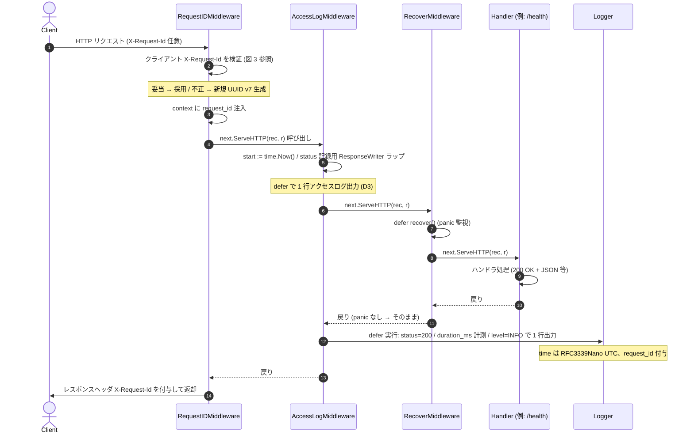
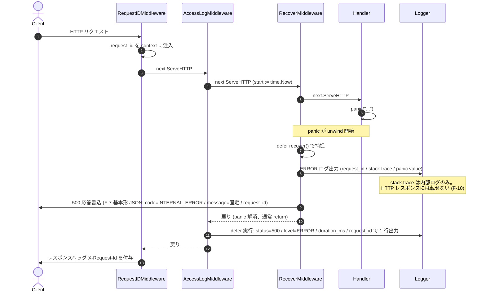
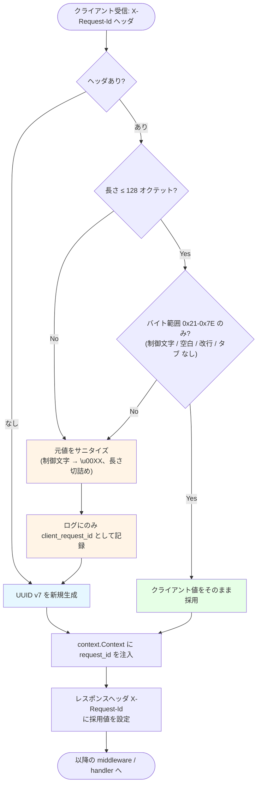

# 設計 #7: ログ・エラー・request_id の規約と core/ への組み込み

- 関連要求: [`docs/requirements/7/index.md`](../../requirements/7/index.md)
- 関連 Issue: [#7](https://github.com/mktkhr/id-core/issues/7)
- マイルストーン: [M0.2: ログ・エラー・request_id の規約確定](https://github.com/mktkhr/id-core/milestone/2)
- 状態: 着手中
- 起票日: 2026-05-02
- 最終更新: 2026-05-02

## 関連資料

- 要求文書: [`docs/requirements/7/index.md`](../../requirements/7/index.md)
- 認可マトリクス (正本): [`docs/context/authorization/matrix.md`](../../context/authorization/matrix.md) (本スコープは認可対象外)
- 先行設計書: [`docs/specs/1/index.md`](../1/index.md) (M0.1: core/ の最小 HTTP サーバー)
- アーキテクチャ概要: [`docs/context/app/architecture.md`](../../context/app/architecture.md)
- backend 規約: [`docs/context/backend/conventions.md`](../../context/backend/conventions.md), [`docs/context/backend/patterns.md`](../../context/backend/patterns.md), [`docs/context/backend/registry.md`](../../context/backend/registry.md)
- 関連スキル: `/backend-logging` (ログ規約), `/backend-security` (シークレット redact), `/backend-architecture` (Domain 層は副作用なし)
- 関連 ADR: なし (本スコープでの新規 ADR は論点解決時に判断。F-7 の基本形を逸脱する場合は要起票)

## 要件の解釈

`core/` (id-core 本体) に**ログ・エラー・request_id の横断規約と middleware**を導入する設計。M0.1 では `/health` の最小骨格しか持たなかった `core/` に、以降のマイルストーン (M0.3 DB / M1.x OIDC) が乗る基盤層を追加する。

新規エンドポイントは追加せず、既存 `/health` の挙動は外形互換 (200 OK + `{"status":"ok"}`) のまま、ログ規約と middleware に乗せ替える。

要求 F-1〜F-17 を以下のように分解する:

| 要求                                          | 設計対応                                                                                                                                                                                                                                  |
| --------------------------------------------- | ----------------------------------------------------------------------------------------------------------------------------------------------------------------------------------------------------------------------------------------- |
| F-1 (JSON Lines + ログインジェクション対策)   | `internal/logger/` に `log/slog` ベースの構造化ロガーを実装。`slog.NewJSONHandler` で JSON エンコーダ経由出力、改行・制御文字は自動エスケープ                                                                                             |
| F-2 (フォーマット切替)                        | 環境変数 `CORE_LOG_FORMAT=json\|text` で切替。デフォルト `json`、開発時は `text` で `slog.NewTextHandler` を使用                                                                                                                          |
| F-3 (HTTP 経路ログのフィールド)               | `internal/middleware/access_log.go` でリクエスト終了時にアクセスログ 1 行出力 (D3)。`time` は RFC3339Nano UTC (Q4)                                                                                                                        |
| F-4 (非 HTTP 経路の `event_id`)               | `internal/logger/` に `WithEventID(ctx, id)` のヘルパーを置き、起動 / signal handler / 将来のジョブが利用。生成は UUID v7 (Q3)                                                                                                            |
| F-5 (`request_id` 生成 + context 伝播)        | `internal/middleware/request_id.go` で UUID v7 (Q3) を生成し `context.Context` に格納、レスポンスヘッダ `X-Request-Id` を必ず返す                                                                                                         |
| F-6 (クライアント `X-Request-Id` 妥当性検証)  | 上記 middleware で長さ ≤128、文字種 `0x21`–`0x7E` の検証。不正値は破棄して再生成、ログには `client_request_id` (サニタイズ後) として残す                                                                                                  |
| F-7 (内部 API エラーレスポンス JSON)          | `internal/apperror/` に基本形 `{ code, message, details?, request_id }` の型と JSON シリアライザを実装 (`backend-architecture` 共通インフラ規約に整合)。Q5 で最終形式確定                                                                 |
| F-8 (OIDC エラー方針)                         | 設計書として M1.x の OIDC エンドポイントが守るべき RFC 6749 / 6750 / OIDC Core 準拠規約を明文化。本スコープでは実装しない                                                                                                                 |
| F-9 (3 系統エラーハンドラ)                    | `internal/middleware/recover_and_error.go` で panic / 既知エラー / 未捕捉 error を統一処理。`request_id` を必ずレスポンスへ含める                                                                                                         |
| F-10 (panic スタックトレース外部漏洩防止)     | エラーハンドラ middleware は panic 時に固定メッセージ + `request_id` のみ返す。スタックトレースは内部の構造化ログ (level=ERROR) にのみ記録                                                                                                |
| F-11 (ログレベル: 5xx/panic=ERROR、4xx≤WARN)  | エラーハンドラ middleware が status から自動判定 (5xx/panic=ERROR、4xx=WARN、それ以外=INFO)。詳細ガイドは `backend-logging` の表 (Q7 で採用) に従う                                                                                       |
| F-12 (`log.Fatal*` 全廃)                      | `core/cmd/core/main.go` の `log.Fatalf` を構造化ロガー (`log/slog` ベース) の `Error` ログ出力 + `os.Exit(1)` 終了処理に置換。CI で `grep -rn "log\.Fatal" core/` を実行 (F-16 と連携)                                                    |
| F-13 (シークレット redact)                    | `internal/logger/redact.go` に deny-list redactor を実装。HTTP middleware からヘッダ・body・query を逐次 redact、エラー `details` も再帰走査                                                                                              |
| F-14 (Domain 層ログ禁止)                      | Domain 層 (今回は `internal/health/` 等の handler 直下のみ存在) はロガーを直接呼ばない。Handler / middleware が `context.Context` から `request_id` / `event_id` を取得して付与                                                           |
| F-15 (`make build && make test && make lint`) | 既存 Makefile を拡張 (新規 target は不要、既存 target 内で動作する)                                                                                                                                                                       |
| F-16 (ログスキーマ契約テスト)                 | `internal/logger/contract_test.go` で HTTP 系・非 HTTP 系の 2 系統に分割。lib/snapshot 系のフィールド存在 + 型検証                                                                                                                        |
| F-17 (規約書)                                 | `docs/context/backend/conventions.md` のロギング・テレメトリ節を本スコープで詳細化 + エラーハンドリング節を新設 (Q10)。最低必須項目: ログフィールド定義 / エラー境界 / redact 一覧 / レベルガイド / 運用手順。検証は `/doc-review` + F-16 |

## 設計時の論点

要求文書から引き継いだ論点 Q1〜Q10。さらに設計フェーズで判明した内部論点 D1〜D3 を追加。決定責任者は全件 mktkhr、期限は 2026-05-16 (要求文書と整合)。

| #   | 論点                                                            | 候補                                                                                                                                                           | 決定                                                                                                                                                                                                                                                                                                                                                                                                                                                                                                                                                              | 理由                                                                                                                                                                                                                                                                                                                                                                                                                        |
| --- | --------------------------------------------------------------- | -------------------------------------------------------------------------------------------------------------------------------------------------------------- | ----------------------------------------------------------------------------------------------------------------------------------------------------------------------------------------------------------------------------------------------------------------------------------------------------------------------------------------------------------------------------------------------------------------------------------------------------------------------------------------------------------------------------------------------------------------- | --------------------------------------------------------------------------------------------------------------------------------------------------------------------------------------------------------------------------------------------------------------------------------------------------------------------------------------------------------------------------------------------------------------------------- |
| Q1  | ロガー実装                                                      | (a) `log/slog` 標準 (b) `zap` (c) `zerolog`                                                                                                                    | **(a) `log/slog` (Go 標準)**                                                                                                                                                                                                                                                                                                                                                                                                                                                                                                                                      | `context/backend/conventions.md` で「M0.2 で `log/slog` ベース」と明記、`backend-logging` でも第一推奨。標準ライブラリで依存追加なし、API 安定性が高い                                                                                                                                                                                                                                                                      |
| Q2  | ログフォーマット切替の環境変数名・値                            | (a) `CORE_LOG_FORMAT=json\|text` (b) `CORE_ENV=production\|development` 間接決定 (c) その他                                                                    | **(a) `CORE_LOG_FORMAT=json\|text`** (デフォルト `json`)                                                                                                                                                                                                                                                                                                                                                                                                                                                                                                          | 既存規約 `CORE_<NAME>` プレフィックスと整合 (`CORE_PORT` と並ぶ)、12-factor のログ出力先指定原則 (環境変数で挙動を切替)                                                                                                                                                                                                                                                                                                     |
| Q3  | 一意 ID の生成方式 (`request_id` / `event_id` 共通)             | (a) UUID v4 (b) UUID v7 (c) ULID (d) snowflake 系                                                                                                              | **(b) UUID v7**                                                                                                                                                                                                                                                                                                                                                                                                                                                                                                                                                   | 時系列ソート可 (Unix ms 先頭 48 bit)、B-tree 主キーとしてのインデックス効率 (M0.3 以降の DB 主キーでも統一)、推測困難性は v7 でも 74 bit 確保。**プロジェクトポリシーで v4 は使用禁止**                                                                                                                                                                                                                                     |
| Q4  | `time` フィールドのフォーマット                                 | (a) RFC3339Nano (UTC、`Z` suffix) (b) RFC3339 秒精度 (c) Unix epoch (ms)                                                                                       | **(a) RFC3339Nano (UTC、`Z` suffix 強制)**                                                                                                                                                                                                                                                                                                                                                                                                                                                                                                                        | `log/slog` のデフォルトフォーマット、ナノ秒精度は診断・順序付けに有用、UTC で TZ 混在排除。PostgreSQL `timestamptz` (UTC 内部表現、μs 精度) と完全互換。**実装方針**: プロセス全体に副作用を持つ `time.Local = time.UTC` は使わず、`slog.NewJSONHandler` の `ReplaceAttr` フックで `time.Time` を `t.UTC().Format(time.RFC3339Nano)` に変換するか、`internal/logger/` の公開 API 内で UTC 化を明示                          |
| Q5  | 内部 API エラーレスポンス JSON 形式の最終形                     | (a) F-7 基本形 (b) RFC 7807 problem+json (c) F-7 基本形 + RFC 7807 互換フィールド                                                                              | **(a) F-7 基本形 (`{ code, message, details?, request_id }`) を `internal/apperror/` パッケージで実装**                                                                                                                                                                                                                                                                                                                                                                                                                                                           | `context/backend/patterns.md` で「M0.2 で `apperror` パッケージ導入」明記。RFC 7807 はクライアント側の利点が薄く、フロントエンド (examples) からの取り回しを優先。Content-Type は `application/json; charset=utf-8` 固定                                                                                                                                                                                                    |
| Q6  | OIDC エラーレスポンスでの `request_id` 露出方法                 | (a) `error_uri` 埋め込み (b) RFC 仕様外フィールド `request_id` (c) ヘッダ `X-Request-Id` のみ                                                                  | **(c) ヘッダ `X-Request-Id` のみ**                                                                                                                                                                                                                                                                                                                                                                                                                                                                                                                                | RFC 6749 / 6750 完全準拠 (ボディ仕様改変なし)、`X-Request-Id` は全エンドポイント共通で既に必須 (F-5)、クライアントは header から拾える。`error_uri` 埋め込みは仕様用途と意味的に異なる                                                                                                                                                                                                                                      |
| Q7  | ログレベル使い分けガイド詳細                                    | DEBUG / INFO / WARN / ERROR の境界をどう書くか                                                                                                                 | **`backend-logging` スキルの表をそのまま採用**: DEBUG (本番無効、開発・調査用) / INFO (業務イベント、リクエスト成功・開始/終了) / WARN (4xx エラー、想定外だが処理継続可能) / ERROR (5xx・panic・DB 障害・予期しないエラー、処理失敗)                                                                                                                                                                                                                                                                                                                             | F-11 (5xx/panic=ERROR、4xx≤WARN) と完全に整合、規約変更不要、後続マイルストーンで再定義不要                                                                                                                                                                                                                                                                                                                                 |
| Q8  | redact 対象キーの完全一覧                                       | F-13 の最低リスト + α                                                                                                                                          | **以下を完全リストとして固定** (M0.2 確定):<br>**ヘッダ** (case-insensitive): `Authorization`, `Cookie`, `Set-Cookie`, `Proxy-Authorization`, `X-Api-Key`, `X-Auth-Token`<br>**body / query / form** (case-insensitive 完全一致、ネスト・配列再帰走査): `password`, `current_password`, `new_password`, `access_token`, `refresh_token`, `id_token`, `code`, `code_verifier`, `client_secret`, `assertion`, `client_assertion`, `private_key`, `secret`, `api_key`, `jwt`, `bearer_token`<br>**redact 値**: 文字列 `[REDACTED]` 固定 (長さ・存在情報を漏らさない) | `backend-logging` の OIDC 注意事項 (ID/access/refresh トークン全文禁止、`code_verifier` 禁止) と OAuth 2.0 / OIDC RFC 6749/6750 のトークン項目を全網羅。M1.x 以降の OIDC 実装で漏れがないようここで先に固定                                                                                                                                                                                                                 |
| Q9  | ログ出力失敗時のフォールバック先                                | (a) 標準エラー (b) ring buffer (c) 単に drop                                                                                                                   | **(a) 標準エラー (stderr) フォールバック + drop カウンタ (atomic)**                                                                                                                                                                                                                                                                                                                                                                                                                                                                                               | NFR 可用性「リクエスト継続優先」に整合。stderr に最低限の構造化ログを書き、drop 件数は atomic counter で内部保持。drop カウンタの外部公開 (メトリクス露出) は M1.x のメトリクス導入時に対応                                                                                                                                                                                                                                 |
| Q10 | 規約書の格納場所                                                | (a) `core/docs/conventions/logging.md` (b) `docs/context/conventions/` (c) `docs/specs/7/` 内に閉じる (d) 既存 `docs/context/backend/conventions.md` の拡張    | **(d) `docs/context/backend/conventions.md` のロギング・テレメトリ節を本スコープで詳細化 + エラーハンドリング節を新設して `apperror` 規約を記載**                                                                                                                                                                                                                                                                                                                                                                                                                 | 既存規約整備パスに乗る、M0.3 / M1.x 以降からも単一 SoT として参照しやすい、`core/docs/` の新ディレクトリ作成を回避                                                                                                                                                                                                                                                                                                          |
| D1  | middleware の構成順序 (recover / request_id / access_log)       | (a) recover → request_id → access_log → handler (b) request_id → recover → access_log → handler (c) **request_id → access_log → recover → handler** (d) その他 | **(c) `request_id` → `access_log` → `recover` → `handler`**                                                                                                                                                                                                                                                                                                                                                                                                                                                                                                       | (1) `request_id` を最外側に置くことで panic 時を含む全ログレコードに `request_id` が付く。(2) `recover` を `access_log` の**内側**に置くことで、handler の panic は `recover` が捕捉して 500 応答に変換されてから `access_log` の `defer` に戻る。これにより `access_log` は最終 status (500) と level (ERROR) を正しく観測できる。逆順 (b) だと `access_log.defer` が panic unwind 中に走り、status=0 / level 誤判定になる |
| D2  | `internal/logger/` の公開 API                                   | (a) `slog.Logger` を直接 export (b) 薄い独自インターフェース (c) handler/middleware/service ごとに wrapper 関数を提供                                          | **(b) 薄い独自インターフェース** (`logger.Info(ctx, msg, ...args)` / `logger.Error(ctx, msg, err, ...args)` 形式)                                                                                                                                                                                                                                                                                                                                                                                                                                                 | `backend-logging` のコード例と整合、Q1 の `slog.Logger` を内部実装として隠蔽し将来の差し替え (zap 等) に備える、context.Context から `request_id` / `event_id` を自動付与する責務を集約できる                                                                                                                                                                                                                               |
| D3  | アクセスログの出力タイミング (リクエスト開始時 / 終了時 / 両方) | (a) 終了時のみ (status / duration を含めて 1 行) (b) 開始時 + 終了時 (c) 終了時 + エラー時のみ別エントリ                                                       | **(a) 終了時のみ 1 行**                                                                                                                                                                                                                                                                                                                                                                                                                                                                                                                                           | `backend-logging` 規約・ログ集約基盤との互換性、grep が単純化、ログ量を抑制。長時間処理の進捗観測は別途 INFO ログで対応する想定 (M1.x 以降)                                                                                                                                                                                                                                                                                 |

## 実装対象

| モジュール                         |    実装有無     |
| ---------------------------------- | :-------------: |
| `core/`                            |       ✅        |
| `examples/go-react/backend/`       |        —        |
| `examples/go-react/frontend/`      |        —        |
| `examples/kotlin-nextjs/backend/`  |        —        |
| `examples/kotlin-nextjs/frontend/` |        —        |
| データベース                       | — (M0.3 で対応) |

## ディレクトリ構成

M0.1 で確立した構成に新規パッケージを追加する。

```
core/
├── go.mod
├── Makefile
├── README.md
├── .gitignore
├── cmd/
│   └── core/
│       └── main.go              # 構造化ロガー初期化 + サーバー起動 (log.Fatal 全廃)
├── internal/
│   ├── config/
│   │   ├── config.go            # 既存 + ロガー設定 (Q2 の env を追加)
│   │   └── config_test.go
│   ├── logger/                  # ★ 新規
│   │   ├── logger.go            # log/slog ベース構造化ロガーの初期化、公開 API (D2 薄い独自 IF: Info/Warn/Error/Debug)
│   │   ├── context.go           # context.Context への request_id (UUID v7) / event_id 付与・取得ヘルパー
│   │   ├── format.go            # CORE_LOG_FORMAT=json|text 切替 (Q2)、time は RFC3339Nano UTC 強制 (Q4)
│   │   ├── redact.go            # F-13 deny-list redactor (Q8 完全リスト)
│   │   ├── redact_test.go       # redact 単体テスト
│   │   ├── fallback.go          # ログ出力失敗時の stderr フォールバック + drop counter (Q9)
│   │   └── contract_test.go     # F-16 ログスキーマ契約テスト (HTTP 系 + 非 HTTP 系)
│   ├── apperror/                # ★ 新規 (Q5 で apperror パッケージ採用)
│   │   ├── apperror.go          # 既知エラー型 (CodedError) と code/message 変換、error chain ラップ
│   │   ├── response.go          # F-7 基本形 (`{ code, message, details?, request_id }`) の JSON レスポンス生成
│   │   └── apperror_test.go
│   ├── middleware/              # ★ 新規
│   │   ├── request_id.go        # F-5/F-6: 生成 / 検証 / context 伝播 / レスポンスヘッダ
│   │   ├── request_id_test.go
│   │   ├── recover.go           # F-9/F-10: panic 捕捉 + 構造化ログ + 固定メッセージ応答
│   │   ├── recover_test.go
│   │   ├── access_log.go        # F-3: アクセスログ出力 (status / duration_ms 等)
│   │   └── access_log_test.go
│   ├── server/
│   │   └── server.go            # ServeMux + middleware チェーン (D1: request_id → access_log → recover → handler)
│   └── health/
│       ├── health.go            # 既存。挙動互換 (中身は変更最小)
│       └── health_test.go
└── bin/
    └── core
```

## DB 設計

**スコープ外** (M0.3 で対応)。

## API 設計

### エンドポイント一覧 (M0.2 で新規追加するものなし)

| Method | Path      | 認証        | 変更内容                                                                         |
| ------ | --------- | ----------- | -------------------------------------------------------------------------------- |
| GET    | `/health` | 不要 (公開) | 外形互換。middleware チェーン (request_id / access_log / recover) を通る変更のみ |

### middleware チェーン仕様

D1 で決定した順序: **`request_id` (最外側) → `access_log` → `recover` → `handler`**。

リクエスト処理フロー:

```
Client → request_id (生成 / 検証 / context 注入) → access_log (status/duration 計測) → recover (panic 捕捉) → handler
                                                  ↑                                       ↑
                                              終了時にここで 1 行出力                   panic 時はここで
                                              (recover が 500 を書いた後)              ERROR ログ + 500 応答
```

順序の重要性: `access_log` を `recover` の**外側**に置くことで、handler が panic しても `recover` が先に 500 応答を書き、その後 `access_log` の `defer` が status=500 / level=ERROR を正しく記録できる。逆順では `access_log.defer` が panic unwind 中に走るため status=0 / level 誤判定が発生する。

各 middleware の責務:

| middleware   | 責務                                                                                                                                                                                                                               |
| ------------ | ---------------------------------------------------------------------------------------------------------------------------------------------------------------------------------------------------------------------------------- |
| `request_id` | クライアント `X-Request-Id` の妥当性検証 (F-6)、不正なら破棄して再生成 (UUID v7、Q3)、`context.Context` に格納、レスポンスヘッダに常に付与                                                                                         |
| `recover`    | `defer recover()` で panic 捕捉、内部ログに stack trace 含む ERROR 記録 (F-10)、クライアントには固定メッセージ + `request_id` の F-7 基本形 JSON で 500 を返す                                                                     |
| `access_log` | リクエスト終了時に 1 行出力 (D3): `time` (RFC3339Nano UTC、Q4) / `level` / `msg=access` / `request_id` / `method` / `path` / `status` / `duration_ms`。レベルは F-11 / Q7 ルール (5xx=ERROR / 4xx=WARN / それ以外=INFO) で自動判定 |

### エラーレスポンス JSON 規約

#### 内部 API (F-7)

基本形:

```json
{
  "code": "INVALID_PARAMETER",
  "message": "human readable message",
  "details": {},
  "request_id": "<uuid>"
}
```

- `code` は `SCREAMING_SNAKE_CASE` の固定文字列 (機械可読)
- `message` は人間可読 (i18n は M3.3 以降)
- `details` は object / array に限定、シークレット禁止 (F-13 の redact が再帰走査)
- `request_id` は middleware で付与した値を必ず含める
- `Content-Type: application/json; charset=utf-8`

#### OIDC エンドポイント (F-8、本スコープでは方針宣言のみ)

M1.x 以降の `/authorize` / `/token` / `/userinfo` 等は RFC 6749 / 6750 / OIDC Core 準拠:

```json
{ "error": "invalid_request", "error_description": "...", "error_uri": "..." }
```

Q6 で決定: **OIDC エンドポイントでの `request_id` 露出はレスポンスヘッダ `X-Request-Id` のみ**。RFC 6749 / 6750 のボディ仕様 (`error` / `error_description` / `error_uri` の 3 フィールド) は改変しない。クライアントは header から `X-Request-Id` を取得する。F-7 (内部 API) と F-8 (OIDC) はエンドポイント単位で固定し、混在禁止。

### ログ規約

#### ログメッセージの言語

`backend-logging` 規約に従い、すべてのログメッセージ (`msg` フィールド) は**日本語で記載する**。アクセスログ系の `msg` (`access` 等の固定文字列) は識別子として扱うため英数字でよいが、業務イベント・エラーログは日本語にする。

#### HTTP 経路 (F-3)

```json
{
  "time": "2026-05-02T01:00:00.123456789Z",
  "level": "INFO",
  "msg": "access",
  "request_id": "01978f86-3a01-7b0c-9f3e-1d8c4a9b6e2f",
  "method": "GET",
  "path": "/health",
  "status": 200,
  "duration_ms": 1.23
}
```

- `time`: RFC3339Nano UTC、`Z` suffix 強制 (Q4)。`slog` ハンドラの `ReplaceAttr` で `t.UTC().Format(time.RFC3339Nano)` に変換 (プロセス全体への副作用となる `time.Local = time.UTC` は使わない)
- `request_id`: UUID v7 文字列形式 (Q3)。先頭 48bit が Unix ms timestamp で時系列ソート可能
- 追加フィールドは設計フェーズの最終整理 (`/spec-track`) または運用開始後に拡張する想定

#### 非 HTTP 経路 (F-4)

起動・signal handler・将来のジョブが出すログには `event_id` を必須付与:

```json
{
  "time": "2026-05-02T01:00:00.000000000Z",
  "level": "INFO",
  "msg": "core サーバーを起動します",
  "event_id": "01978f86-3a01-7b0c-9f3e-1d8c4a9b6e2f",
  "port": 8080
}
```

`event_id` は起動毎・ジョブ毎に発番される一意 ID。生成方式は `request_id` と共通で **UUID v7** (Q3)。

### redact 規約 (F-13)

deny-list:

Q8 で確定した完全一覧:

| 適用面                  | 対象キー                                                                                                                                                                                                                          | 照合規則                                             |
| ----------------------- | --------------------------------------------------------------------------------------------------------------------------------------------------------------------------------------------------------------------------------- | ---------------------------------------------------- |
| HTTP リクエストヘッダ   | `Authorization`, `Cookie`, `Set-Cookie`, `Proxy-Authorization`, `X-Api-Key`, `X-Auth-Token`                                                                                                                                       | case-insensitive                                     |
| JSON body / `details`   | `password`, `current_password`, `new_password`, `access_token`, `refresh_token`, `id_token`, `code`, `code_verifier`, `client_secret`, `assertion`, `client_assertion`, `private_key`, `secret`, `api_key`, `jwt`, `bearer_token` | case-insensitive かつ完全一致 / ネスト・配列再帰走査 |
| query / form パラメータ | 同上 (body と同一リスト)                                                                                                                                                                                                          | case-insensitive かつ完全一致                        |
| error chain メッセージ  | 同上 (文字列の fuzzy 検出は行わず、構造化フィールド経由でのみ redact)                                                                                                                                                             | キー一致のみ (本文の string match はしない)          |

**redact 値**: 文字列 `[REDACTED]` 固定で置換する。長さや存在情報を漏らさない (`****` のようなマスキングではなく `[REDACTED]` とする理由: 攻撃者にトークン長を推測させない)。

> `backend-logging` の OIDC 注意事項に準拠: ID/access/refresh トークン全文ログ禁止 (jti / sub / 先頭数文字のみが必要なら個別に明示出力)。`code_verifier` (PKCE) は値そのものが秘匿対象。

### ログ出力失敗時の挙動 (Q9)

ロガーの書き込みが失敗した場合 (例: stdout writer エラー、stdout 詰まり):

1. リクエスト処理は**継続する** (NFR 可用性最優先)
2. 失敗したログレコードを **stderr に最低限のフォールバック出力** を試みる (stderr も失敗した場合は静かに drop)
3. drop 件数を **atomic counter** で内部保持 (`expvar` または `internal/logger/fallback.go` 内の sync/atomic)
4. drop counter の外部公開 (Prometheus / OpenTelemetry メトリクス) は M1.x のメトリクス導入時に対応 (本スコープ外)

部分一致は誤検知の温床なので**禁止**。完全一覧は Q8 で確定。

## 認可設計

**本スコープは認可対象外**。

[`docs/context/authorization/matrix.md`](../../context/authorization/matrix.md) (正本) と差分なし。新規エンドポイント追加なし、`/health` は引き続き認証不要・公開エンドポイント。

> マスターと差分なし。本スコープでの認可マトリクス変更提案もなし。

## フロー図 / シーケンス図

### 図 1: 正常系のリクエスト処理シーケンス

middleware の wrap 順序は `request_id` (最外側) → `access_log` → `recover` → `handler`。`access_log` の `defer` は `recover` が応答を書き終えた後に最終 status / level を観測する (D1 順序の根拠)。



### 図 2: panic 時のフロー

handler の panic を `recover` が捕捉し、固定メッセージ + `request_id` の F-7 基本形 JSON で 500 応答を書く。スタックトレースは内部 ERROR ログ (level=ERROR) にのみ記録し、HTTP レスポンスへ漏洩させない (F-10)。`access_log` は `recover` の外側にあるため、`recover` が 500 を書き終えた後に最終 status を観測できる。



### 図 3: 不正な `X-Request-Id` 受信時のフロー

クライアント提供の `X-Request-Id` を妥当性検証 (長さ ≤ 128 オクテット / バイト範囲 `0x21`–`0x7E` / 制御文字・改行・空白・タブ禁止) し、不正値は破棄して新規 UUID v7 を発番する。元値はサニタイズ (制御文字を `\u00XX` 化、長さ切詰め) のうえ、ログにのみ `client_request_id` として残す。



## テスト観点

各テストケースに対応する要件 (F-N) / 論点 (Q-N / D-N) を「関連」列に明示する。実装プロンプト (`/spec-prompts` または `/issue-from-spec`) はここから直接 T-N を引いてテスト関数名にできる粒度で記載。

### `internal/logger/` (`core/internal/logger/`)

#### ロガー初期化・フォーマット切替 (`logger.go` / `format.go`)

| #   | カテゴリ     | 観点                                               | 期待                                                                                            | 関連        |
| --- | ------------ | -------------------------------------------------- | ----------------------------------------------------------------------------------------------- | ----------- |
| T-1 | 正常系       | `CORE_LOG_FORMAT=json` (またはデフォルト) で初期化 | `slog.NewJSONHandler` ベースのロガーが返る、出力は 1 行 JSON で `time` / `level` / `msg` を含む | F-1, Q1, Q2 |
| T-2 | 正常系       | `CORE_LOG_FORMAT=text` で初期化                    | `slog.NewTextHandler` ベースのロガーが返る、出力は `key=value` 形式                             | F-2, Q2     |
| T-3 | 異常系       | `CORE_LOG_FORMAT=invalid` で初期化                 | エラーが返る (`fmt.Errorf` で原因含む)、main 側で `Error` ログ + `os.Exit(1)`                   | F-2, Q2     |
| T-4 | 正常系       | `time` フィールドのフォーマット                    | `2026-05-02T01:00:00.123456789Z` 形式 (RFC3339Nano、UTC、`Z` suffix)                            | F-3, Q4     |
| T-5 | セキュリティ | プロセス全体への副作用がない                       | ロガー初期化前後で `time.Local` が変化しない (`Z` 変換は `ReplaceAttr` 経由で行う)              | Q4          |

#### context 伝播 (`context.go`)

| #   | カテゴリ | 観点                                                        | 期待                                                                               | 関連         |
| --- | -------- | ----------------------------------------------------------- | ---------------------------------------------------------------------------------- | ------------ |
| T-6 | 正常系   | `WithRequestID(ctx, "v7-uuid")` 後に `RequestIDFrom(ctx)`   | 元の値が取り出せる                                                                 | F-5, F-14    |
| T-7 | 正常系   | `WithEventID(ctx, "v7-uuid")` 後に `EventIDFrom(ctx)`       | 元の値が取り出せる                                                                 | F-4, F-14    |
| T-8 | 準正常系 | request_id を入れていない context から `RequestIDFrom(ctx)` | 空文字またはゼロ値が返る (panic しない)                                            | F-14         |
| T-9 | 正常系   | logger 経由でログ出力時に context から自動付与              | `request_id` (HTTP 経路) または `event_id` (非 HTTP 経路) がログレコードに含まれる | F-3, F-4, D2 |

#### redact (`redact.go`)

| #    | カテゴリ     | 観点                                                            | 期待                                                                             | 関連     |
| ---- | ------------ | --------------------------------------------------------------- | -------------------------------------------------------------------------------- | -------- |
| T-10 | セキュリティ | HTTP ヘッダ `Authorization: Bearer xxx` を redact               | ログ出力で `[REDACTED]` に置換される                                             | F-13, Q8 |
| T-11 | セキュリティ | HTTP ヘッダ `authorization: bearer xxx` (case 違い) を redact   | case-insensitive で `[REDACTED]` 置換                                            | F-13, Q8 |
| T-12 | セキュリティ | JSON body `{"password": "secret"}` を redact                    | `password` 値が `[REDACTED]` 置換                                                | F-13, Q8 |
| T-13 | セキュリティ | ネストした JSON `{"outer": {"client_secret": "xxx"}}` を redact | 再帰走査で `client_secret` 値が `[REDACTED]` 置換                                | F-13, Q8 |
| T-14 | セキュリティ | 配列内の JSON `{"creds": [{"access_token": "x"}]}` を redact    | 配列要素も走査して `access_token` 値が `[REDACTED]` 置換                         | F-13, Q8 |
| T-15 | セキュリティ | redact 対象キーの全 16 フィールドを網羅                         | Q8 完全リスト全件が `[REDACTED]` に置換される (テーブル駆動テスト)               | F-13, Q8 |
| T-16 | セキュリティ | redact 対象キーの全 6 ヘッダを網羅                              | Q8 完全リスト (Authorization 等 6 件) が case-insensitive で `[REDACTED]` 置換   | F-13, Q8 |
| T-17 | 準正常系     | redact 対象でないキー `username` は変換しない                   | 値はそのまま保持される (部分一致禁止: `accessusername` のような誤検知が起きない) | F-13, Q8 |
| T-18 | セキュリティ | redact 対象キーが存在しない場合の出力                           | 元の構造のまま `[REDACTED]` 置換は発生しない                                     | F-13     |

#### ログ出力失敗フォールバック (`fallback.go`)

| #    | カテゴリ | 観点                                             | 期待                                                                               | 関連          |
| ---- | -------- | ------------------------------------------------ | ---------------------------------------------------------------------------------- | ------------- |
| T-19 | 異常系   | stdout writer がエラーを返す状況をモックして再現 | リクエスト処理は継続 (panic しない)、stderr に最低限のフォールバック行が出力される | NFR可用性, Q9 |
| T-20 | 異常系   | stdout / stderr 両方失敗する状況                 | 処理継続、drop counter が増加 (`atomic.LoadInt64` で確認可能)                      | NFR可用性, Q9 |
| T-21 | 正常系   | 通常出力時の drop counter                        | 0 のまま増加しない                                                                 | Q9            |

### `internal/middleware/request_id.go`

| #    | カテゴリ     | 観点                                                              | 期待                                                                            | 関連     |
| ---- | ------------ | ----------------------------------------------------------------- | ------------------------------------------------------------------------------- | -------- |
| T-22 | 正常系       | リクエストに `X-Request-Id` ヘッダなし                            | 新規 UUID v7 生成、context に注入、レスポンスヘッダに同値設定                   | F-5, Q3  |
| T-23 | 正常系       | クライアント `X-Request-Id: abc123-XYZ` (妥当)                    | 受け取った値をそのまま採用、context / レスポンスヘッダに同値                    | F-5, F-6 |
| T-24 | 境界値       | クライアント `X-Request-Id` が 128 オクテット ちょうど            | 採用される                                                                      | F-6      |
| T-25 | 境界値       | クライアント `X-Request-Id` が 129 オクテット                     | 破棄、新規生成、ログに `client_request_id` (サニタイズ・切詰め) として残る      | F-6      |
| T-26 | 異常系       | クライアント `X-Request-Id` に改行 (`\n` / `\r`) を含む           | 破棄、新規生成、`client_request_id` に制御文字を `\u00XX` 化して記録            | F-6, F-1 |
| T-27 | 異常系       | クライアント `X-Request-Id` に空白 (`0x20`) を含む                | 破棄、新規生成 (空白も拒否対象)                                                 | F-6      |
| T-28 | 異常系       | クライアント `X-Request-Id` にタブ (`0x09`) を含む                | 破棄、新規生成                                                                  | F-6      |
| T-29 | 異常系       | クライアント `X-Request-Id` に DEL 文字 (`0x7F`) を含む           | 破棄、新規生成 (`0x21`–`0x7E` 範囲外)                                           | F-6      |
| T-30 | 正常系       | レスポンスヘッダ `X-Request-Id` の常時付与 (200 / 4xx / 5xx 全て) | どの status でもヘッダが必ず付く                                                | F-5      |
| T-31 | 正常系       | UUID v7 生成方式の検証                                            | 出力フォーマットが UUID 形式 (8-4-4-4-12)、バージョンビットが `7` (`xxx7-xxxx`) | Q3       |
| T-32 | セキュリティ | サニタイズ後 `client_request_id` 値の長さ                         | サニタイズ後の長さが 128 オクテット以下に切り詰められる (DoS 防止)              | F-6      |

### `internal/middleware/recover.go`

| #    | カテゴリ     | 観点                                            | 期待                                                                                                                             | 関連           |
| ---- | ------------ | ----------------------------------------------- | -------------------------------------------------------------------------------------------------------------------------------- | -------------- |
| T-33 | 異常系       | handler が `panic("test")` した場合の HTTP 応答 | HTTP 500、Content-Type `application/json; charset=utf-8`、ボディは F-7 基本形 JSON (固定 `code` / 固定 `message` / `request_id`) | F-9, F-10, F-7 |
| T-34 | セキュリティ | panic レスポンスにスタックトレースが含まれない  | `body` 内に `goroutine` / `runtime/panic` / 内部ファイルパスの文字列が現れない                                                   | F-10           |
| T-35 | 異常系       | panic レスポンスに `request_id` が含まれる      | レスポンス JSON の `request_id` フィールドが context の値と一致                                                                  | F-9, F-5       |
| T-36 | 異常系       | panic 時の内部ログ                              | level=ERROR、`msg` (日本語)、`request_id`、`error` 値、`stack_trace` フィールドにスタック情報を含む                              | F-10, F-11     |
| T-37 | 正常系       | handler が panic しない場合                     | recover の defer は何もしない (パススルー)                                                                                       | F-9            |
| T-38 | 異常系       | panic value が `error` 型の場合                 | error chain を `error` フィールドに記録                                                                                          | F-10           |
| T-39 | 異常系       | panic value が string や任意の値の場合          | `fmt.Sprintf("%v", v)` で文字列化してログに記録                                                                                  | F-10           |

### `internal/middleware/access_log.go`

| #    | カテゴリ     | 観点                                                                       | 期待                                                                                                                                        | 関連          |
| ---- | ------------ | -------------------------------------------------------------------------- | ------------------------------------------------------------------------------------------------------------------------------------------- | ------------- |
| T-40 | 正常系       | 200 OK の handler                                                          | 終了時に 1 行 INFO ログ、フィールド: `time` / `level=INFO` / `msg=access` / `request_id` / `method` / `path` / `status=200` / `duration_ms` | F-3, F-11, D3 |
| T-41 | 準正常系     | 4xx を返す handler                                                         | level=WARN で出力                                                                                                                           | F-11, Q7      |
| T-42 | 異常系       | 5xx を返す handler                                                         | level=ERROR で出力                                                                                                                          | F-11, Q7      |
| T-43 | 異常系       | recover が 500 を書いた場合 (T-33 と統合)                                  | access_log は最終 status=500 / level=ERROR を観測 (D1 順序の検証)                                                                           | D1            |
| T-44 | 正常系       | `duration_ms` の精度                                                       | float64 で記録、ms 単位 (例: 1.234)                                                                                                         | F-3           |
| T-45 | セキュリティ | `path` のクエリ文字列に redact 対象キーが含まれる場合 (例: `?code=secret`) | クエリ文字列の `code` 値が `[REDACTED]` 化されてログに残る (F-13 適用面の query)                                                            | F-13, Q8      |
| T-46 | 正常系       | 開始時はログを出さない (D3: 終了時のみ)                                    | 開始時に出力されるログが存在しない (handler 実行中のログだけが INFO で 1 行のみ)                                                            | D3            |

### `internal/apperror/` (Q5 採用)

| #    | カテゴリ     | 観点                                                                            | 期待                                                                                             | 関連     |
| ---- | ------------ | ------------------------------------------------------------------------------- | ------------------------------------------------------------------------------------------------ | -------- |
| T-47 | 正常系       | `apperror.New(code, message)` を JSON シリアライズ                              | `{"code":"...","message":"...","request_id":"..."}` (details なし)                               | F-7, Q5  |
| T-48 | 正常系       | `apperror.New(...).WithDetails(map[string]any{"field":"value"})` をシリアライズ | `details` フィールドに object 形式で含まれる                                                     | F-7      |
| T-49 | セキュリティ | `details` にシークレット (例: `password`) を入れた場合                          | redact が再帰走査で `[REDACTED]` 置換                                                            | F-13     |
| T-50 | 正常系       | `details` 型制約 (object / array のみ)                                          | string / number / bool を直接 `details` にすると compile error または runtime バリデーション失敗 | F-7      |
| T-51 | 正常系       | error chain の `errors.Is` / `errors.As` 互換性                                 | `Unwrap()` メソッドで原因 error が取得できる                                                     | F-7      |
| T-52 | 異常系       | request_id が context にない場合のエラーレスポンス生成                          | `request_id` フィールドは空文字またはゼロ値、ボディは正しい JSON                                 | F-7, F-9 |

### 統合テスト (`httptest` 経由)

| #    | カテゴリ     | 観点                                                                       | 期待                                                                                                      | 関連          |
| ---- | ------------ | -------------------------------------------------------------------------- | --------------------------------------------------------------------------------------------------------- | ------------- |
| T-53 | 正常系       | middleware チェーン全体を組み立てて `GET /health` を叩く                   | 200 OK + JSON `{"status":"ok"}` (M0.1 互換) + ヘッダ `X-Request-Id`                                       | F-5, F-15     |
| T-54 | 正常系       | 統合チェーン経由でログ buffer を取得し、access_log 行が 1 行出力されている | T-40 のフィールド構成と一致                                                                               | F-3, D1, D3   |
| T-55 | 異常系       | テスト用 panic endpoint (例: `/test-panic`) を組み込んで叩く               | T-33〜T-36 の挙動を統合チェーンで再現 (request_id が response / ログ両方で一致)                           | F-9, F-10, D1 |
| T-56 | セキュリティ | クライアント `Authorization: Bearer xxx` ヘッダ付きで叩く                  | アクセスログで `Authorization` が `[REDACTED]` 化される                                                   | F-13          |
| T-57 | セキュリティ | クライアント `X-Request-Id` に改行入りで叩く                               | レスポンスヘッダに新規生成された UUID v7、ログに `client_request_id` (`\u00XX` エスケープ済み) として残る | F-6           |

### F-16 ログスキーマ契約テスト (`internal/logger/contract_test.go`)

| #    | カテゴリ | 観点                                                                 | 期待                                                                                                                                                                                  | 関連      |
| ---- | -------- | -------------------------------------------------------------------- | ------------------------------------------------------------------------------------------------------------------------------------------------------------------------------------- | --------- |
| T-58 | 契約     | HTTP 経路ログ (`msg=access`) のフィールド存在 + 型                   | 必須: `time` (string, RFC3339Nano UTC) / `level` (string) / `msg` (string) / `request_id` (string) / `method` (string) / `path` (string) / `status` (number) / `duration_ms` (number) | F-16      |
| T-59 | 契約     | 非 HTTP 経路ログ (起動 / signal handler / job) のフィールド存在 + 型 | 必須: `time` (string) / `level` (string) / `msg` (string) / `event_id` (string)                                                                                                       | F-16, F-4 |
| T-60 | 契約     | フィールド追加は許容 (将来の拡張)                                    | 追加フィールドが含まれてもテスト失敗しない                                                                                                                                            | F-16      |
| T-61 | 契約     | フィールド削除は失敗 (破壊的変更検知)                                | 必須フィールドが欠けると `t.Errorf` で失敗                                                                                                                                            | F-16      |
| T-62 | 契約     | フィールド型変更は失敗 (例: `status` が string になる等)             | 型不一致でテスト失敗                                                                                                                                                                  | F-16      |

### `core/cmd/core/main.go` (F-12 完了条件)

| #    | カテゴリ | 観点                                       | 期待                                                                    | 関連          |
| ---- | -------- | ------------------------------------------ | ----------------------------------------------------------------------- | ------------- |
| T-63 | 契約     | CI で `grep -rn 'log\.Fatal' core/` を実行 | 出力が 0 件 (新規追加コードでも `log.Fatal*` 禁止)                      | F-12          |
| T-64 | 異常系   | 設定読み込み失敗時の挙動                   | 構造化ロガーで `Error` ログ + `os.Exit(1)`、`log.Fatalf` を使用しない   | F-12          |
| T-65 | 正常系   | サーバー起動時の `event_id` 付き INFO ログ | `msg="core サーバーを起動します"` (日本語) / `event_id` / `port` を含む | F-4, F-14, Q3 |

### E2E

M0.2 では実施しない (M1.5 から導入予定)。本マイルストーンの動作確認は Go 単体テスト + httptest 統合テストで完結する。

## 既存資料からの差分

実装フェーズで `docs/context/` 配下に以下の更新を適用する。本セクションは設計書側の差分整理であり、実際の context 反映は実装プロンプト (`/spec-prompts` または実装 PR) で行う。

### `docs/context/backend/conventions.md`

| 節                        | 更新内容                                                                                                                                                                                                                                                                                                                                                                                                             |
| ------------------------- | -------------------------------------------------------------------------------------------------------------------------------------------------------------------------------------------------------------------------------------------------------------------------------------------------------------------------------------------------------------------------------------------------------------------- |
| ロギング・テレメトリ      | M0.1 暫定の記述を置換し、(1) ロガー = `log/slog` (Q1)、(2) フォーマット切替 = `CORE_LOG_FORMAT=json\|text` (Q2)、(3) 一意 ID = UUID v7 (Q3)、(4) `time` = RFC3339Nano UTC (Q4)、(5) ログレベル使い分け表 (Q7、`backend-logging` から引用)、(6) HTTP 経路 / 非 HTTP 経路の必須フィールド一覧 (F-3 / F-4)、(7) ログ出力失敗時の挙動 (Q9: stderr フォールバック + drop counter)、(8) ログメッセージ言語 = 日本語 を確定 |
| エラーハンドリング (新設) | M0.1 patterns.md の暫定 (`fmt.Errorf` で `%w` ラップ) を踏襲しつつ、`internal/apperror/` パッケージの導入を記載 (Q5)。F-7 基本形 `{ code, message, details?, request_id }` の JSON シリアライズ形式、`code` 命名規則 (`SCREAMING_SNAKE_CASE`)、`details` の型制約 (object / array)、redact 対象キー一覧 (F-13 / Q8 完全リスト)、OIDC エンドポイント (M1.x 以降) 向けの RFC 6749 / 6750 準拠方針 (F-8 / Q6) を記載    |
| middleware 構成           | 新節として `request_id → access_log → recover → handler` の D1 順序、各 middleware の責務、`context.Context` 経由の ID 伝播 (F-14) を記載                                                                                                                                                                                                                                                                            |
| 環境変数命名              | 既存 `CORE_<NAME>` プレフィックス規約に `CORE_LOG_FORMAT` を追加                                                                                                                                                                                                                                                                                                                                                     |

### `docs/context/backend/patterns.md`

| 節                                    | 更新内容                                                                                                                                                                                                               |
| ------------------------------------- | ---------------------------------------------------------------------------------------------------------------------------------------------------------------------------------------------------------------------- |
| middleware チェーンパターン (新設)    | D1 順序の図とコード例を追加 (`request_id → access_log → recover → handler`)、`http.HandlerFunc` を wrap する実装サンプル                                                                                               |
| context への ID 付与パターン (新設)   | `internal/logger/context.go` の `WithRequestID(ctx, id) context.Context` / `RequestIDFrom(ctx) string` / `WithEventID` / `EventIDFrom` のコード例。Domain 層は context から取り出すのみで logger を呼ばない原則 (F-14) |
| redact パターン (新設)                | `internal/logger/redact.go` の deny-list 実装の最小サンプル (case-insensitive ヘッダ照合 / JSON 再帰走査 / `[REDACTED]` 固定置換)                                                                                      |
| エラーハンドリング (置換)             | M0.1 暫定の `fmt.Errorf` + `%w` ラップ記述を、`internal/apperror/` の `New(code, message)` / `WithDetails(...)` パターンに置換。error chain は `errors.Is` / `errors.As` 互換、HTTP レスポンス変換は middleware で行う |
| ログ出力失敗時のフォールバック (新設) | stderr フォールバック + atomic drop counter のコード例 (Q9)                                                                                                                                                            |

### `docs/context/backend/registry.md`

| 節                   | 更新内容                                                                                                                                                              |
| -------------------- | --------------------------------------------------------------------------------------------------------------------------------------------------------------------- |
| パッケージマッピング | `core/internal/logger` (構造化ロガー)、`core/internal/apperror` (エラー型 + JSON シリアライザ)、`core/internal/middleware` (request_id / access_log / recover) を追加 |
| 環境変数一覧         | `CORE_LOG_FORMAT` を追加 (既定値 `json` / 値は `json` または `text` / 必須=任意)                                                                                      |
| エラーコード一覧     | M0.2 で確定する最低限のコードを記載: `INTERNAL_ERROR` (panic 時の固定 code、F-9 / F-10)、その他は M1.x 以降で OIDC 標準コードと統合                                   |

### `docs/context/testing/backend.md` (TBD → 最低限の埋め込み)

| 節                     | 更新内容                                                                                                                                                                                                                                                                                            |
| ---------------------- | --------------------------------------------------------------------------------------------------------------------------------------------------------------------------------------------------------------------------------------------------------------------------------------------------- |
| Go (id-core) のテスト  | 標準パターン: `httptest.NewRequest` + `mux.ServeHTTP` (M0.1 から踏襲)、外部テストパッケージ命名 (`<pkg>_test`)、`t.Setenv` と `t.Parallel` の併用不可 (M0.1 patterns.md から引用)、テーブル駆動テスト (redact deny-list で活用)、ログ buffer での検証パターン、`grep -rn "log\.Fatal" core/` ガード |
| ログスキーマ契約テスト | F-16 のフィールド存在 + 型検証パターン。HTTP 系・非 HTTP 系の 2 系統に分割。フィールド追加は許容、削除・型変更はテスト失敗の方針                                                                                                                                                                    |

### `core/` 自体の変更 (実装フェーズで対応)

- `core/cmd/core/main.go` の `log.Fatalf` 全廃 (F-12)、構造化ロガー初期化に置換、起動時 INFO ログに `event_id` (UUID v7) と `port` を含める
- `core/internal/health/health.go` の `_ = json.NewEncoder(w).Encode(...)` の暫定コメントを削除し、エラー時は `apperror.New(...)` で適切に処理 (F-9)
- `core/internal/server/server.go` で middleware チェーン (D1 順序) を組み込む
- `core/Makefile` に `lint` target で `grep -rn "log\.Fatal" core/` 検査を追加 (F-12 完了条件 / T-63)
- `core/README.md` にログ・エラー規約の入口段落を追加し、`docs/context/backend/conventions.md` へリンク

## 設計フェーズ状況

| フェーズ               | 状態       | 備考                                                                                                                                                                                                                                          |
| ---------------------- | ---------- | --------------------------------------------------------------------------------------------------------------------------------------------------------------------------------------------------------------------------------------------- |
| 1. 起票                | 完了       | 2026-05-02                                                                                                                                                                                                                                    |
| 2. 下書き              | 完了       | テンプレートから生成、要件 F-1〜F-17 を構造化、論点 Q1〜Q10 + D1〜D3 を整理                                                                                                                                                                   |
| 3. 規約確認            | 完了       | `/check-convention` で context/backend (conventions/patterns/registry) と backend-logging / backend-architecture / backend-security スキルを調査。`internal/apperror/` 命名規約 / `code_verifier` redact / 日本語ログメッセージを設計書に反映 |
| 4. 論点解決            | 完了       | `/spec-resolve` で Q1〜Q10 + D1〜D3 を全件確定 (規約由来 6 件 + ユーザー判断 7 件)                                                                                                                                                            |
| 5. DB 設計             | スコープ外 | M0.3 で対応                                                                                                                                                                                                                                   |
| 6. API 設計            | 完了       | エラーレスポンス規約 (内部 API + OIDC 方針) / ログ規約 (HTTP + 非 HTTP) / redact 規約 (Q8 完全一覧) / middleware チェーン (D1 順序) を確定                                                                                                    |
| 7. 認可設計            | 完了       | 認可スコープ外、マスター差分なし                                                                                                                                                                                                              |
| 8. 図                  | 完了       | `/spec-diagrams` で 3 図生成: (1) 正常系リクエストシーケンス、(2) panic 時フロー、(3) 不正 `X-Request-Id` 受信時フロー                                                                                                                        |
| 9. テスト設計          | 完了       | `/spec-tests` で T-1〜T-65 (65 ケース) を確定。logger / middleware (request_id / recover / access_log) / apperror / 統合 / 契約テスト / main.go を網羅。E2E は M1.5 から                                                                      |
| 10. 差分整理           | 完了       | `/spec-track` で context (conventions / patterns / registry / testing) と core/ への影響を確定。実反映は実装フェーズ                                                                                                                          |
| 11. 実装プロンプト生成 | 未着手     | `/spec-prompts` または `/issue-from-spec`                                                                                                                                                                                                     |

## 変更履歴

| 日付       | 変更内容                                                                                                                                                                                                                                                                                                                                                                                                                                                                                                                                   |
| ---------- | ------------------------------------------------------------------------------------------------------------------------------------------------------------------------------------------------------------------------------------------------------------------------------------------------------------------------------------------------------------------------------------------------------------------------------------------------------------------------------------------------------------------------------------------ |
| 2026-05-02 | 起票 (要求 #7 から `/spec-create` で生成)。F-1〜F-17 の設計対応マッピング、論点 Q1〜Q10 + D1〜D3 を整理                                                                                                                                                                                                                                                                                                                                                                                                                                    |
| 2026-05-02 | `/check-convention` 実施: `internal/errors/` → `internal/apperror/` にリネーム (backend-architecture 共通インフラ規約整合)、F-13 redact 対象に `code_verifier` 追加 (backend-logging OIDC 注意事項)、ログ規約節に「ログメッセージは日本語」原則を追記 (backend-logging)。フェーズ 3 を完了に更新                                                                                                                                                                                                                                           |
| 2026-05-02 | `/spec-resolve` 実施: 論点 Q1〜Q10 + D1〜D3 を全件確定。Q1=`log/slog`、Q2=`CORE_LOG_FORMAT=json\|text`、Q3=**UUID v7** (v4 禁止)、Q4=RFC3339Nano UTC、Q5=F-7 基本形 + `internal/apperror/` パッケージ、Q6=`X-Request-Id` ヘッダのみ、Q7=`backend-logging` のレベル表、Q8=redact 完全一覧 (16 キー + 6 ヘッダ)、Q9=stderr フォールバック + drop カウンタ、Q10=`docs/context/backend/conventions.md` 拡張、D1=`request_id`→`recover`→`access_log`→`handler`、D2=薄い独自 IF、D3=終了時 1 行。フェーズ 4 / 6 を完了、フェーズ 10 の方向性確定 |
| 2026-05-02 | Codex PR レビュー (PR #10) 指摘反映: D1 middleware 順序を `request_id`→`recover`→`access_log`→`handler` から **`request_id`→`access_log`→`recover`→`handler`** に変更 (panic 時に `access_log.defer` が status=0 を記録してしまう問題回避)。「既存資料からの差分」の `core/internal/{logger,errors,middleware}` 表記を `apperror` に統一。Q4 の実装方針に「プロセス全体副作用となる `time.Local = time.UTC` は使わず `slog` ハンドラの `ReplaceAttr` で UTC 変換」を明記                                                                   |
| 2026-05-02 | `/spec-diagrams` 実施: 3 図を mermaid で追加。(1) 正常系リクエスト処理シーケンス (middleware チェーン D1 順序を反映: request_id → access_log → recover → handler)、(2) panic 時フロー (recover が 500 応答を書いた後 access_log が status=500 を観測する流れ)、(3) 不正 `X-Request-Id` 受信時のフロー (validation → サニタイズ → client_request_id 記録 → 新規 UUID v7 発番)。フェーズ 8 を完了                                                                                                                                            |
| 2026-05-02 | `/spec-tests` 実施: テスト観点を T-1〜T-65 (65 ケース) に詳細化。logger (T-1〜T-21)、middleware request_id (T-22〜T-32)、middleware recover (T-33〜T-39)、middleware access_log (T-40〜T-46)、apperror (T-47〜T-52)、統合テスト (T-53〜T-57)、契約テスト (T-58〜T-62)、main.go (T-63〜T-65) を網羅。各ケースに F-N / Q-N / D-N の関連を明記。フェーズ 9 を完了                                                                                                                                                                             |
| 2026-05-02 | `/spec-track` 実施: 「既存資料からの差分」を最終化。context への影響を 4 ファイル (`conventions.md` / `patterns.md` / `registry.md` / `testing/backend.md`) で具体化、`core/` 側の変更も列挙 (`main.go` の log.Fatal 全廃 / Makefile lint 追加 / README 規約入口追加)。実反映は実装フェーズで対応する旨を明示。フェーズ 10 を完了                                                                                                                                                                                                          |
